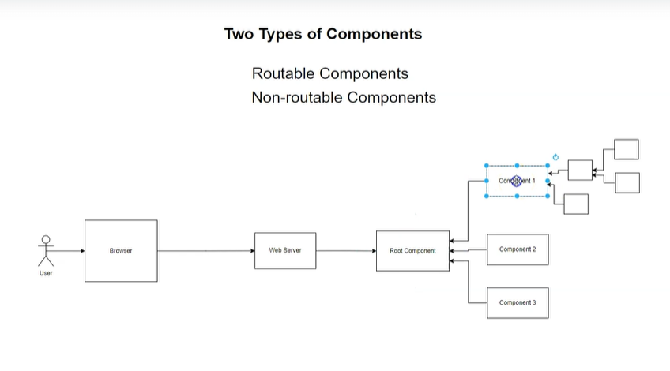
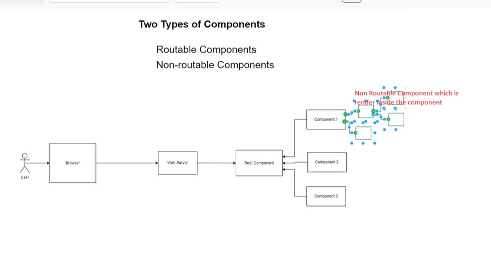
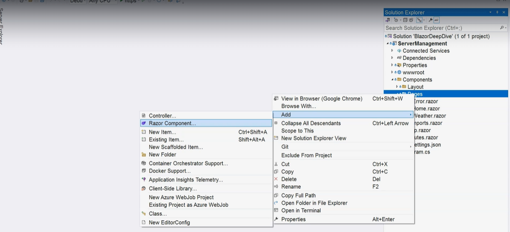
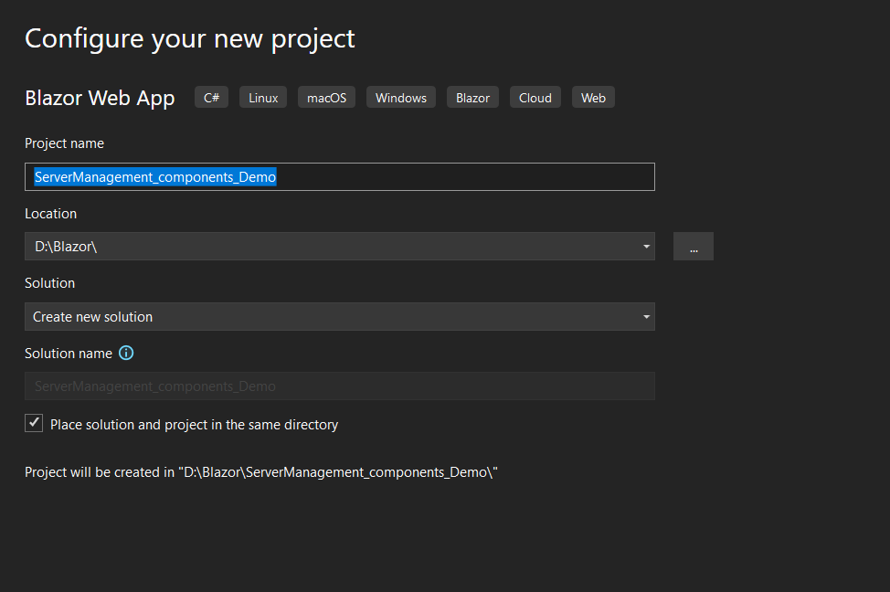
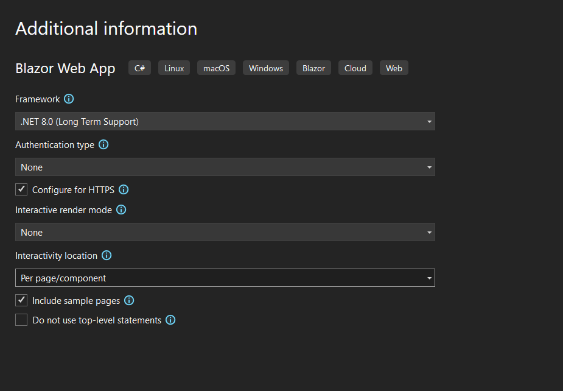
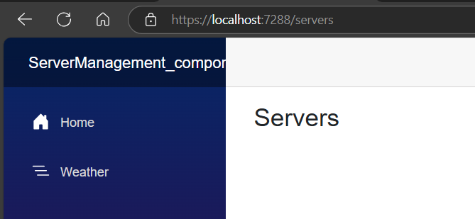
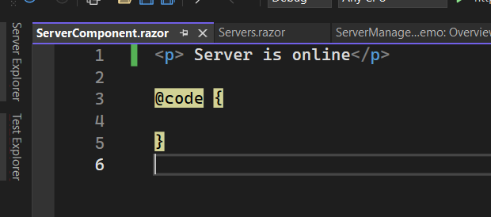

Blazor is component based application

Routable (or) Page Component
non-routable component &rarr; which sometimes called reusable components

let us create Routable Component

Right click on Pages &rarr; Add Razor Component &rarr; Servers.razor

@page "/servers"  <mark> `Routable Component` </mark>
 <h3>Servers</h3>

@code {

}

Run the App

# Lets create non routable component

Right click on Components &rarr; Add New Folder  &rarr; Controls  &rarr;Right click on Controls folder &rarr; add Razor component &rarr;ServerComponent.razor

 Server is online

@code {

}

Next we need add this inside routable component

goto Servers.razor

<ServerManagement_components_Demo.Components.Controls.ServerComponent>
</ServerManagement_components_Demo.Components.Controls.ServerComponent>

instead of writing the above code we can simply write in below format using 
@using directive in page level. 
the same can be used in application level also for that we need use the same in imports.razor page

@page "/servers"  
@using ServerManagement_components_Demo.Components.Controls
 <h3>Servers</h3>

 
 

<ServerManagement_components_Demo.Components.Controls.ServerComponent>
</ServerManagement_components_Demo.Components.Controls.ServerComponent>

@code {

}

# imports.razor
@using ServerManagement_components_Demo.Components.Controls

# servers.razor
@page "/servers" 

 <h3>Servers</h3>
 
 
<ServerComponent> </ServerComponent>
@code {

}

# Razor Syntax Implicit Razor Expression