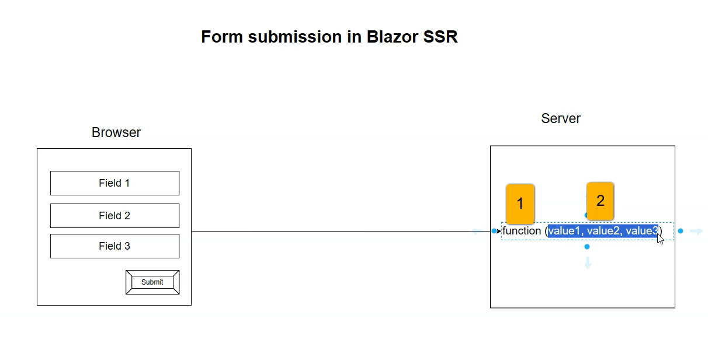
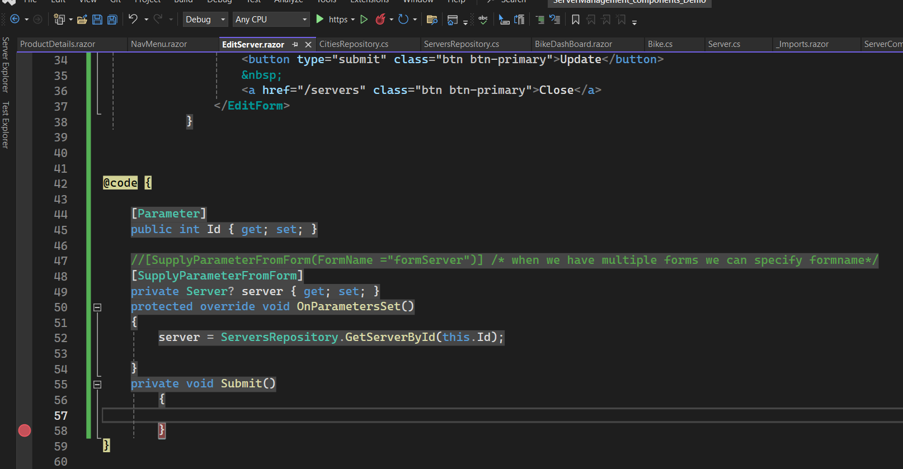
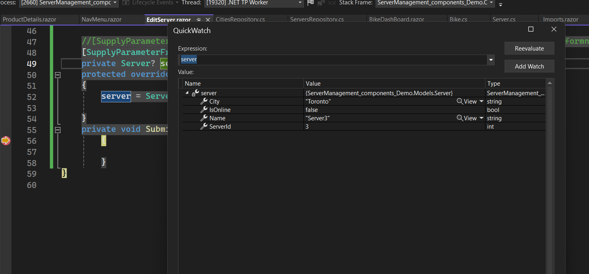

# Form submission and model binding



Now let us change the EditServer.razor
 `<EditForm Model="server" FormName="formServer" onSubmit="Submit"> `

  `   <br />
    <button type="submit" class="btn btn-primary">Update</button>
    &nbsp;
    <a href="/servers" class="btn btn-primary">Close</a>
</EditForm>
`

` private Server? server { get; set; }`

`[SupplyParameterFromForm(FormName ="formServer")] &rarr; when we have  multiple forms we can specify formname`

`[SupplyParameterFromForm] 
private Server? server { get; set; }
`

`private void Submit() { } `
```razor

```



Run and change check or uncheck the checkbox.
debug
quick watch the server object



It shows wrong value for isOnline property .Reason behind whenever request goes it calls `OnParametersSet()` method and it takes the value from ServerRepository.

# How to avoid calling `OnParametersSet()`

Needs to avaoid calling OnParametersSet() when server is not null.
`server ??= ServersRepository.GetServerById(this.Id);`

Which means rightside part will be skipped when server is not null.


While quickwatch it shows serverid is 0 
`  <InputNumber @bind-Value="server.ServerId" hidden></InputNumber>`

### let's write the logic for formsubmission
private void Submit()
{
    if (server != null)
    {
        ServersRepository.UpdateServer(server.ServerId, server);
    }
}

after update click the close button to check the update as we didi not redirect to servers page to check the updated list of server.