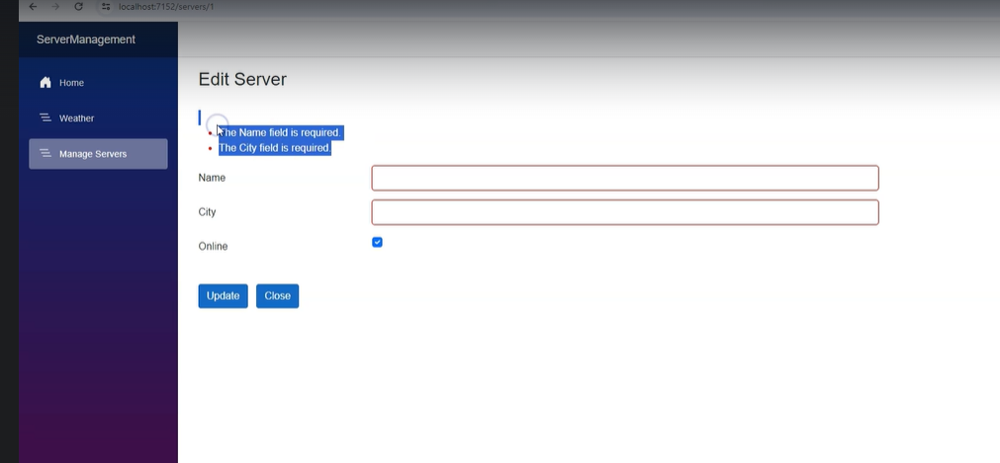

#  Form Validations


## Server.cs
        `[Required]
        public string? Name { get; set; }
        [Required]
        public string? City { get; set; }
        `
```cs
using System.ComponentModel.DataAnnotations;

namespace ServerManagement_components_Demo.Models
{
    public class Server
    {
        public Server()
        {
            Random random = new Random();
            int randomNumber=random.Next(0,2);
            IsOnline = randomNumber==0?false:true;
        }
        public int ServerId { get; set; }
        public bool IsOnline { get; set; }
        [Required]
        public string? Name { get; set; }
        [Required]
        public string? City { get; set; }
    }
}
```

`EditServer.razor`
Add below line inside the EditForm
`  <DataAnnotationsValidator></DataAnnotationsValidator>
  <ValidationSummary></ValidationSummary>
  `

  ` <EditForm Model="server" FormName="formServer" OnValidSubmit="Submit">`

