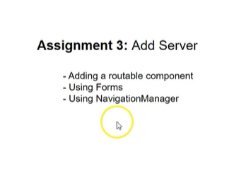

# Navigation with NavigationManager & Dependency Injection

# What is NavigationManager in blazor 8.0?

NavigationManager is a Blazor service that provides navigation functionality within a Blazor application. It allows you to programmatically navigate between different pages and components, get the current URL, and manage navigation events.

Key Features of NavigationManager
Programmatic Navigation: You can navigate to different routes programmatically without reloading the entire page.

**Current URL:** Retrieve the current URL, URI, and query parameters.

**Navigation Events:** Subscribe to navigation events to perform actions before or after navigation.

**Base URI:** Get the base URI for the application.

## Basic Usage
To use NavigationManager, you need to inject it into your Blazor component 
or service.

Injecting NavigationManager
In your Blazor component, inject the NavigationManager service:
```razor
@page "/example"
@inject NavigationManager Navigation

<h3>Navigation Example</h3>

<button @onclick="NavigateToHome">Go to Home</button>

@code {
    private void NavigateToHome()
    {
        Navigation.NavigateTo("/");
    }
}
```

## Programmatic Navigation

The NavigateToHome method uses the NavigateTo 
method of NavigationManager to navigate to the home page ("/").

## Real-World Example
Let's consider a scenario where you have a product listing page, and you want to
 navigate to a product detail page when a product is selected.

 # Product List Component
 ```razor
 @page "/products"
@inject NavigationManager Navigation

<h3>Product List</h3>

<ul>
    @foreach (var product in products)
    {
        <li @onclick="() => NavigateToProduct(product.Id)">
            @product.Name
        </li>
    }
</ul>

@code {
    private List<Product> products = new List<Product>
    {
        new Product { Id = 1, Name = "Product 1" },
        new Product { Id = 2, Name = "Product 2" },
    };

    private void NavigateToProduct(int productId)
    {
        Navigation.NavigateTo($"/product/{productId}");
    }
}

 ```

 # Product Detail Component
```razor
@page "/product/{productId:int}"
@inject NavigationManager Navigation

<h3>Product Details</h3>

@if (product == null)
{
    <p>Loading...</p>
}
else
{
    <div>
        <p>ID: @product.Id</p>
        <p>Name: @product.Name</p>
        <p>Description: @product.Description</p>
    </div>
}

@code {
    [Parameter]
    public int productId { get; set; }

    private Product product;

    protected override void OnParametersSet()
    {
        // Simulate fetching product details
        product = new Product
        {
            Id = productId,
            Name = $"Product {productId}",
            Description = $"Description for product {productId}."
        };
    }

    private class Product
    {
        public int Id { get; set; }
        public string Name { get; set; }
        public string Description { get; set; }
    }
}

```

# Explanation   
**Product List Component:**

Injects the NavigationManager service.

Displays a list of products with clickable items that navigate to the product detail page using the NavigateTo method.

**Product Detail Component:**

Defines a route with a parameter {productId}.

Uses the OnParametersSet method to fetch and display product details based on the route parameter.


# EditServer.razor

Add below lines of code
`@inject NavigationManager NavigationManager`
` NavigationManager.NavigateTo("/servers"); `
  `  private  void Submit()
  {
      if (server != null)
      {
          ServersRepository.UpdateServer(server.ServerId, server);
      }
      NavigationManager.NavigateTo("/servers");
     
  }
`

# The Use of @inject in Blazor 8.0

In Blazor 8.0, the `@inject` directive is used to inject services into your Blazor components. This enables you to access shared services and resources within your components by leveraging Dependency Injection (DI).

## What Does @inject Do?

The `@inject` directive allows you to:

- **Access Services**: Easily inject and use services that have been registered in the dependency injection container.
- **Promote Code Reuse**: Share common functionality across multiple components by using injected services.
- **Simplify Testing**: Improve testability by allowing dependencies to be easily mocked and injected.

## How to Use @inject

### Basic Usage

To use `@inject`, declare the directive followed by the type of the service and the name you want to give it in your component:

```razor
@page "/example"
@inject NavigationManager Navigation

<h3>Example Page</h3>
<button @onclick="NavigateToHome">Go to Home</button>

@code {
    private void NavigateToHome()
    {
        Navigation.NavigateTo("/");
    }
}
```

NavigationManager.NavigateTo("/servers") &rarr; equal to
` var navigationManager=new NavigationManager();
navigationManager.NavigateTo("/servers")

Here why we don't want to create an object here we don't 
want ceate an instance in another class
no need to manage object lifespan, 




right click on Pages &rarr; Add new component >AddServer.razor
```razor
@page  "/servers/add"

@inject NavigationManager NavigationManager

<h3>Add Server</h3>
<br />
<br />
<EditForm Model="server" FormName="formServer" OnValidSubmit="Submit">
    <DataAnnotationsValidator></DataAnnotationsValidator>   
    <ValidationSummary></ValidationSummary>       
    <div class="row mb-3">        <div class="col-2">         
        <label class="col-form-label">Name</label>     
                  </div>      
    <div class="col-6">  
        <InputText  @bind-Value="server.Name" class="form-control"></InputText>   
        
        </div>       
    <div class="col">     
        <ValidationMessage For="() => server.Name"></ValidationMessage>     
        </div>    </div>   
    <div class="row mb-3">     
    <div class="col-2">      
        <label class="col-form-label">City</label>     
        </div>        <div class="col-6">         
        <InputText  @bind-Value="server.City" class="form-control"></InputText> 
                    </div>        
    <div class="col">          
        <ValidationMessage For="() => server.City"></ValidationMessage>   
        </div>   
    </div>   
    <div class="row mb-3">     
    <div class="col-2">
        <label class="col-form-label">Online</label>    
        </div>        <div class="col-6">      
        <InputCheckbox  @bind-Value="server.IsOnline" class="form-check-input"></InputCheckbox> 
                    </div>  
        </div>
    <br />  
    <button class="btn btn-primary" type="submit">Save</button>  
    &nbsp;    <a href="/servers" class="btn btn-primary">Close</a></EditForm>
   

 @code{

     [SupplyParameterFromForm]
     private Server server { get; set; } = new Server() { IsOnline = false };

     private void Submit()
     {
         if (server != null)
         {
             ServersRepository.AddServer(server);
             NavigationManager.NavigateTo($"/servers");
         }
     }
}

```

Let's do DeleteServer in servers.razor component

```razor
@page "/servers"

@inject NavigationManager NavigationManager
<h3>Servers</h3>
<br />
<br />

<div class="container-fluid">
    <div class="row">
        @foreach (var city in cities)
        {
            <div class="col">
                <div class="card">
                    
                    <div class="card-body">
                        <button type="button" class="btn btn-primary">@city</button>
                    </div>
                </div>               
            </div>
        }
    </div>
</div>

<ul>
    @foreach(var server in servers)
            {
                <li>
                    @server.Name is in @server.City is
                    <span style="color:@(server.IsOnline?"green":"red")">
                        @(server.IsOnline?"Online.":"Offline.")
                    </span>&nbsp;
                    <a href="/servers/@server.ServerId" class="btn btn-link">Edit</a>
                    &nbsp;
                    <EditForm Model="server" FormName="@($"form-server-{server.ServerId}")"
                              OnValidSubmit="@(() => {DeleteServer(server.ServerId);})">
                        <button type="submit" class="btn btn-primary">Delete</button>
                        </EditForm>
                </li>
            }
</ul>

<a href="/servers/add" class="btn btn-primary">Add Server</a>
@code {
    private List<Server> servers = ServersRepository.GetServersByCity("Toronto");
    private List<string> cities = CitiesRepository.GetCities();
    private void DeleteServer(int serverId)
    {
        if (serverId != null)
        {
            ServersRepository.DeleteServer(serverId);
            NavigationManager.NavigateTo("Servers");
        }
    }
}

```