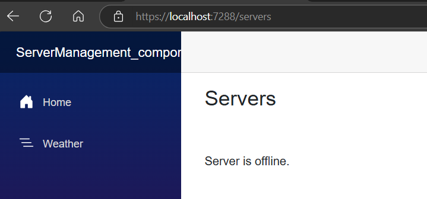
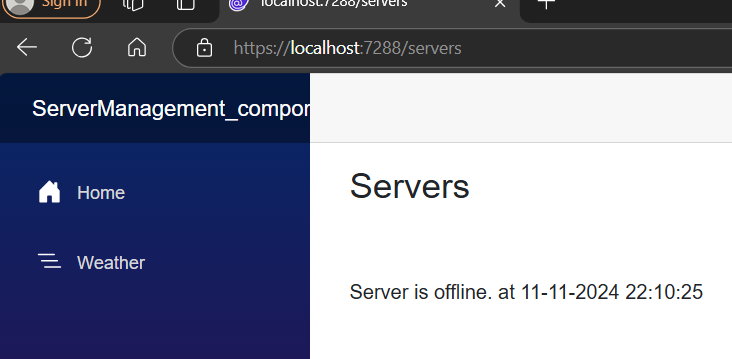
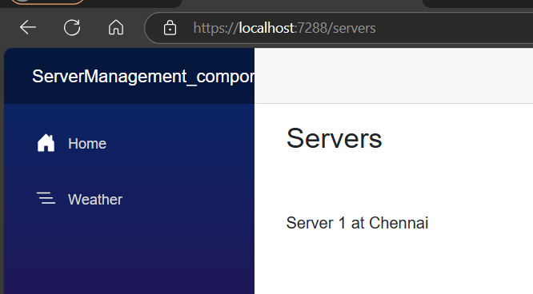
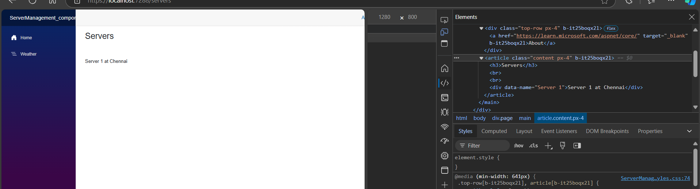

# Razor Syntax Implicit Razor Expression
## What is Razor syntax Implicit Razor Expression in blazor 8.0?
In Blazor 8.0, an Implicit Razor Expression is a way to embed C# code within Razor syntax. It starts with the @ symbol followed by C# code. Implicit expressions are useful for embedding simple expressions directly into the HTML.

Here's an example:
```cs
<p>@DateTime.Now</p>
<p>@DateTime.IsLeapYear(2024)</p>
```

@DateTime.Now will be replaced with the current date and time.

@DateTime.IsLeapYear(2024) will evaluate whether the year 2024 is a leap year and return true or false

Implicit Razor expressions are great for simple inline code, but for more complex logic, you might want to use explicit Razor expressions or code blocks.

## Let us demo it in our Existing App

goto `ServerComponent.razor`
```cs
<p> @status  </p>
@code {
    private string status = "Server is offline.";
}
```

run the App.


```cs
<p> @status at @DateTime.Now </p>

@code {
    private string status = "Server is offline.";
}
```


Right click on the Project &rarr; Add New Folder &rarr; Models &rarr Add class name it as `Server.cs`

```cs
namespace ServerManagement_components_Demo.Models
{
    public class Server
    {
        public Server()
        {
            Random random = new Random();
            int randomNumber=random.Next(0,2);
            IsOnline = randomNumber==0?false:true;
        }
        public int ServerId { get; set; }
        public bool IsOnline { get; set; }
        public string? Name { get; set; }
        public string? City { get; set; }
    }
}
```

# imports.razor
```cs 
@using ServerManagement_components_Demo.Models
```

# ServerComponent.razor
```cs
<p> @server.Name at @server.City</p>

@code {
    private Server server = new Server { Name = "Server 1", City = "Chennai" };
}
```

Run the App.




## Modify `Servercomponent.raor`  code as below
```cs
@*<p> @server.Name at @server.City</p>*@

<div data-name="@server.Name">

    @server.Name at @server.City
</div>

@code {
    private Server server = new Server { Name = "Server 1", City = "Chennai" };
}
```


