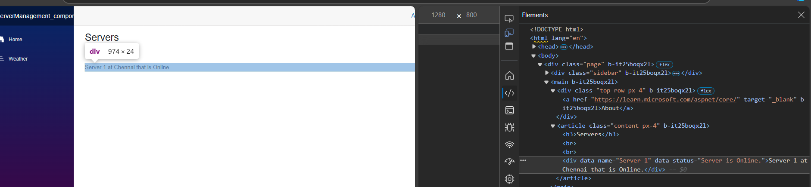
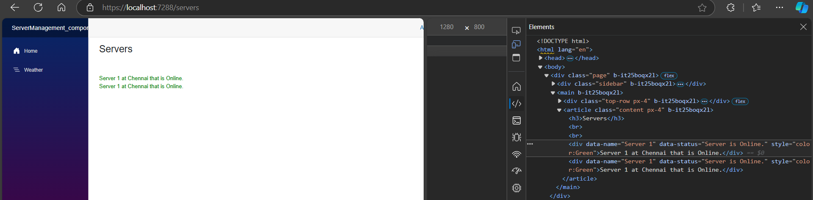
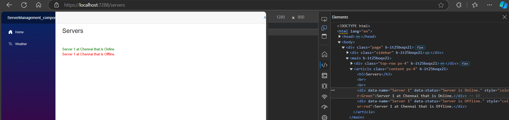
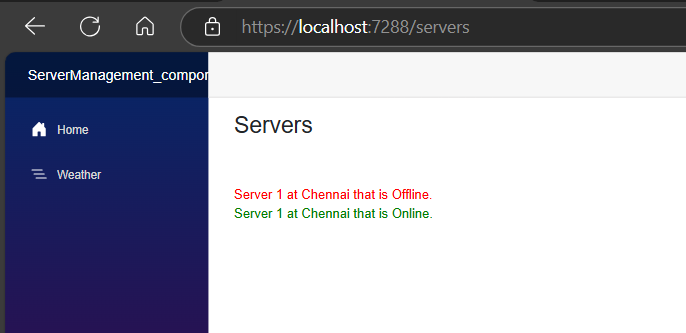

# Razor syntax Explicit Razor Expression
# Explicit Razor Expressions in Blazor 8.0

In Blazor 8.0, an **Explicit Razor Expression** involves more complex or conditional logic embedded within your Razor components. These are denoted by the `@` symbol followed by code enclosed in parentheses.

## When to Use Explicit Razor Expressions
- When you need to evaluate more complex expressions or perform more extensive logic that isn't suited for implicit expressions.
- When working with conditional statements, loops, or invoking methods that return values to be rendered.

## Example Scenario
Let's say you are creating a dashboard for a Bike Store that displays a message based on the number of available bikes.

### Step-by-Step Example

#### Define the Bike Model:

```csharp
public class Bike
{
    public int BikeId { get; set; }
    public string Name { get; set; }
    public decimal Price { get; set; }
    public int Quantity { get; set; }
}
```
# Create a Razor Component

## Add a new Razor component named BikeDashboard.razor

Implement the logic using explicit Razor expressions.

### BikeDashboard.razor:

```razor
@page "/bikedashboard"
@using System.Collections.Generic

<h3>Bike Store Dashboard</h3>

@code {
    private List<Bike> Bikes = new List<Bike>
    {
        new Bike { BikeId = 1, Name = "Mountain Bike", Price = 299.99m, Quantity = 10 },
        new Bike { BikeId = 2, Name = "Road Bike", Price = 499.99m, Quantity = 0 },
        new Bike { BikeId = 3, Name = "Hybrid Bike", Price = 399.99m, Quantity = 5 }
    };

    private string GetAvailabilityMessage(Bike bike)
    {
        return bike.Quantity > 0 ? "In Stock" : "Out of Stock";
    }
}

<ul>
    @foreach (var bike in Bikes)
    {
        <li>
            <strong>@bike.Name</strong>: @(GetAvailabilityMessage(bike))
        </li>
    }
</ul>
```
## Explanation:
**Bike Model:** The Bike class defines the structure of a bike, including properties like BikeId, Name, Price, and Quantity.

### Razor Component (BikeDashboard.razor):

**Bike List:** A list of bikes is defined with their respective quantities.

**Explicit Razor Expression:** The GetAvailabilityMessage method is called using the explicit Razor syntax @(GetAvailabilityMessage(bike)), which determines if each bike is "In Stock" or "Out of Stock".

### Key Points:
Explicit Razor Expressions are useful for embedding more complex C# logic within Razor components.

They enable you to incorporate conditional statements, loops, and method calls directly in your markup.

**Best Practices:** Use explicit Razor expressions to keep your Razor pages clean and maintainable by offloading complex logic to code blocks or methods.

# Our demo
## serverComponent.razor

```razor
<div data-name="@server.Name">
    @server.Name at @server.City  that is  @(server.IsOnline?"Online.":"Offline.")
</div>

@code {
    private Server server = new Server { Name = "Server 1", City = "Chennai" };
}
```

## Explicit Expression we can use in attribut as well
```razor

<div data-name="@server.Name" data-status="Server is @(server.IsOnline?"Online.":"Offline.")">
    @server.Name at @server.City  that is  @(server.IsOnline?"Online.":"Offline.")
</div>

@code {
    private Server server = new Server { Name = "Server 1", City = "Chennai" };
}
```


# Apply style using Explicit Expression razor syntax
```razor
<div data-name="@server.Name" data-status="Server is @(server.IsOnline?"Online.":"Offline.")"
    style="color:@(server.IsOnline?"Green":"red")" >

    @server.Name at @server.City  that is  @(server.IsOnline?"Online.":"Offline.")
</div>

@code {
    private Server server = new Server { Name = "Server 1", City = "Chennai" };
}
```

## Servers.razor page
```razor
@page "/servers"  
 <h3>Servers</h3>
<br/>
<br/>
<ServerComponent> </ServerComponent>
<ServerComponent> </ServerComponent>
@code {

}
```
Run the App





# Apply style using string interpolation Explicit Expression razor syntax
```razor

<div data-name="@server.Name" data-status="Server is @(server.IsOnline?"Online.":"Offline.")"
    style="@($"color:{(server.IsOnline?"Green":"red")}")" >

    @server.Name at @server.City  that is  @(server.IsOnline?"Online.":"Offline.")
</div>

@code {
    private Server server = new Server { Name = "Server 1", City = "Chennai" };
}
```



