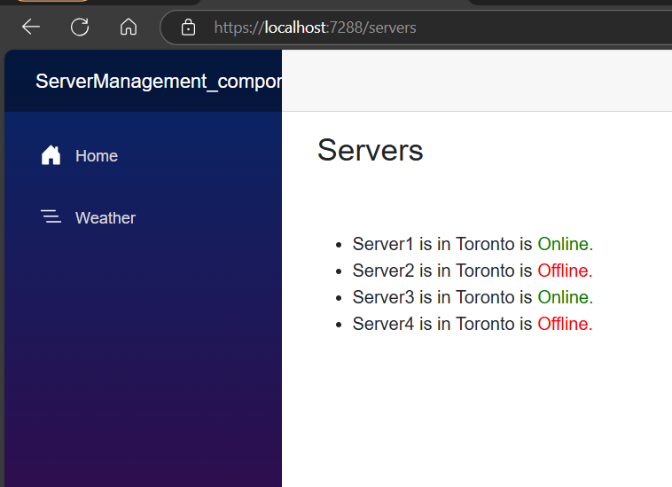

# Razor Syntax Output list with looping

### goto `Servers.razor`
```razor
@page "/servers"  
 <h3>Servers</h3>
<br/>
<br/>
<ul>
    @foreach(var server in servers)
            {
                <li>@server.Name is in @server.City is
                <span style="color:@(server.IsOnline?"Green":"Red")">
                @(server.IsOnline?"Online.":"Offline.")
                </span>
                </li>
            }
</ul>

@code {
    private List<Server> servers = ServersRepository.GetServersByCity("Toronto");
}
```

