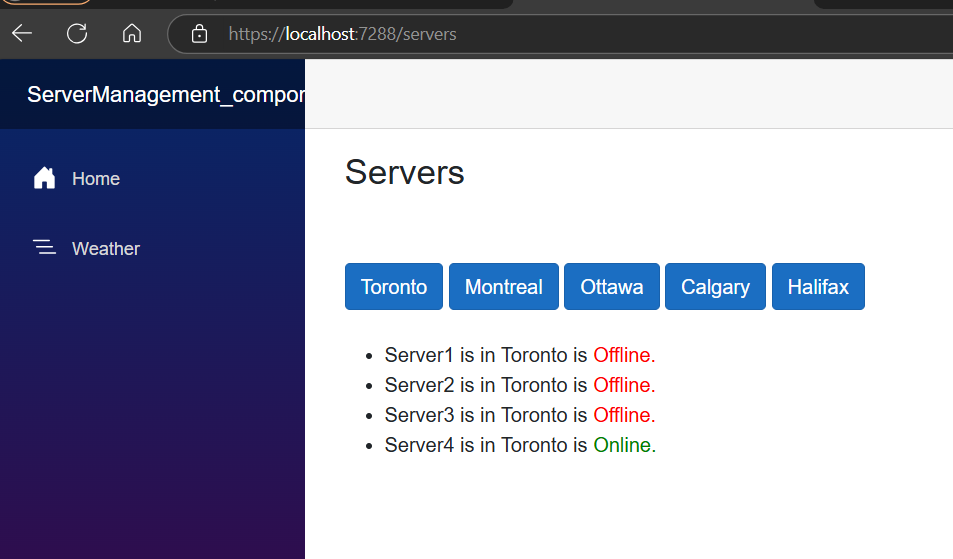
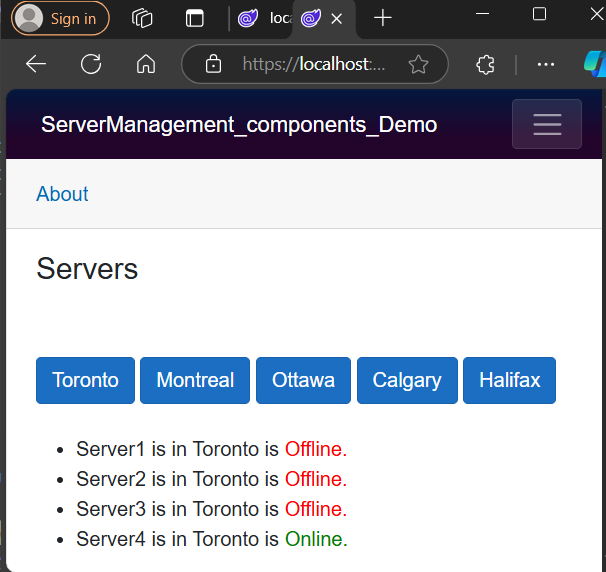
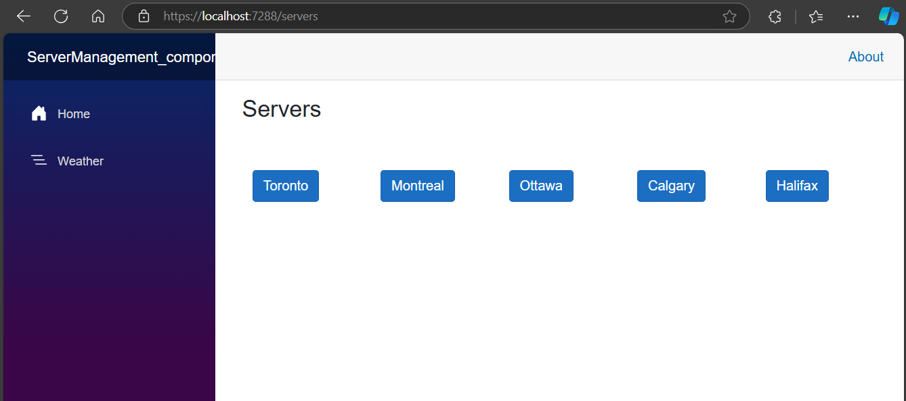
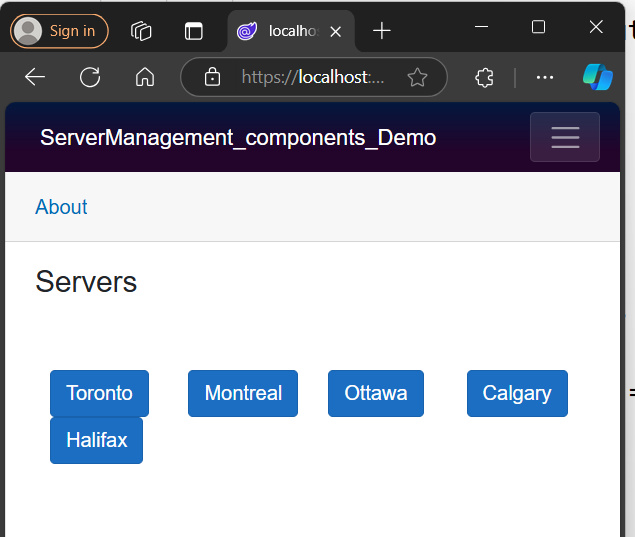

# Output city buttons list

Add New class in Models Folder and Name it as `CitiesRepository.cs`

## CitiesRepository.cs

```cs
 public static class CitiesRepository
    {
        private static List<string> cities = new List<string>()
        {
            "Toronto",
            "Montreal",
            "Ottawa",
            "Calgary",
            "Halifax"
        };

        public static List<string> GetCities() => cities;
        
    }
```

## Servers.razor

```razor
@page "/servers"  
 <h3>Servers</h3>
<br/>
<br/>
@foreach(var city in cities)
            {
                <button type="button">@city</button> &nbsp;
}
<br/>
<br/>
<ul>
    @foreach(var server in servers)
            {
                <li>@server.Name is in @server.City is
                <span style="color:@(server.IsOnline?"Green":"Red")">
                @(server.IsOnline?"Online.":"Offline.")
                </span>
                </li>
            }
</ul>

@code {
    private List<Server> servers = ServersRepository.GetServersByCity("Toronto");
    private List<string> cities = CitiesRepository.GetCities();
}

```

&nbsp; it shows an error as it is considering object or C# code but actually it is not C# code. To tell it is not C# code instead it is html
code.

wrap &nbsp; with <text>
   `<text>&nbsp;</text>`
apply  `class="btn btn-primary"`  for button

Run the App.





Whenever we minimize the buttons are not collapse

so let us bootstrap class
```razor
@page "/servers"
<h3>Servers</h3>
<br />
<br />

<div class="container-fluid">
    <div class="row">
        @foreach (var city in cities)
        {
            <div class="col">
                <button type="button" class="btn btn-primary">@city</button>
            </div>
        }
    </div>
</div>

@code {
    private List<Server> servers = ServersRepository.GetServersByCity("Toronto");
    private List<string> cities = CitiesRepository.GetCities();
}
```




