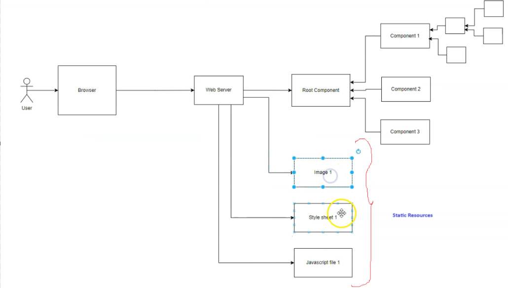
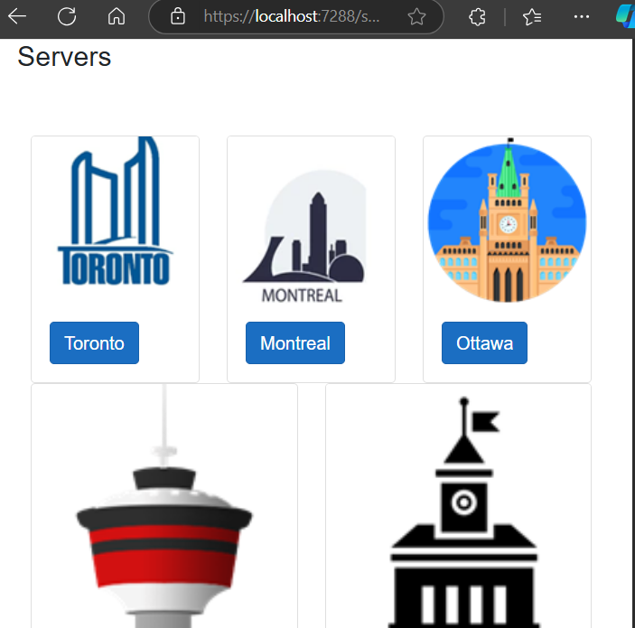
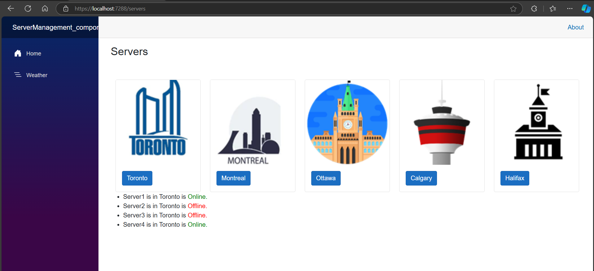
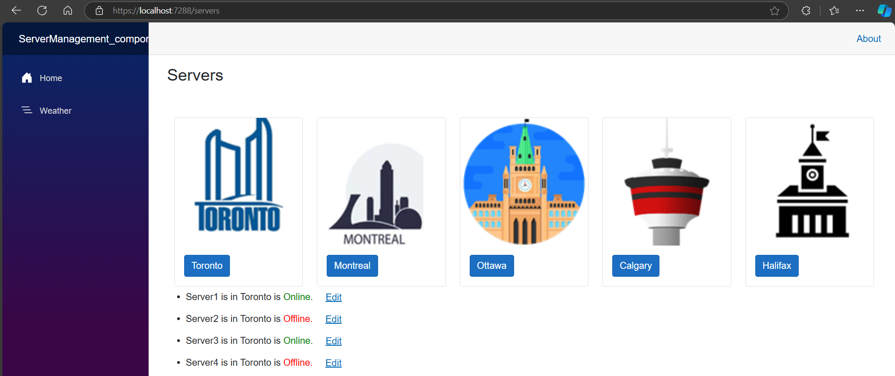
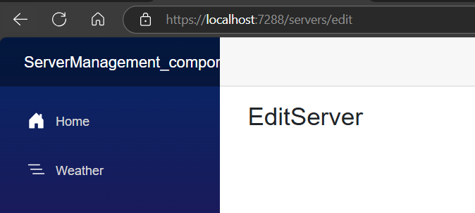
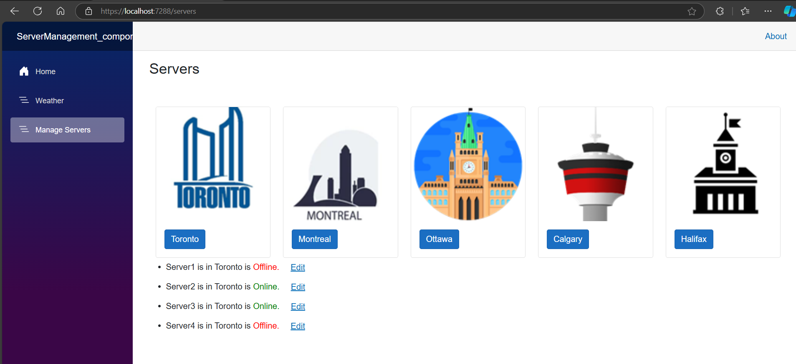

# Working with Static Resources
static resources refer to files that are served directly by the web server without any server-side processing. These include assets like images, stylesheets, JavaScript files, and other static content1. Static resources are typically stored in the wwwroot folder in a Blazor project.



## List of Common Static Resources in Blazor
**Images:** PNG, JPEG, GIF files used for icons, logos, and other visual elements.

**Stylesheets:** CSS files for styling the application.

**JavaScript Files:** JS files for client-side scripting.

**Fonts:** TTF, OTF, WOFF files for custom fonts.

**HTML Files:** Static HTML files that can be included or linked.

**Data Files:** JSON, CSV files for static data.

Let us create images folder &rarr; Add images inside the folder

the servers.razor page
let us some style like bootstrap card (you can choose the style according to you need)
```razor
@page "/servers"
<h3>Servers</h3>
<br />
<br />

<div class="container-fluid">
    <div class="row">
        @foreach (var city in cities)
        {
            <div class="col">
                <div class="card">
                    
                    <div class="card-body">
                        <button type="button" class="btn btn-primary">@city</button>
                    </div>
                </div>               
            </div>
        }
    </div>
</div>
<ul>
    @foreach(var server in servers)
            {
                <li>@server.Name is in @server.City is 
                <span style="color:@(server.IsOnline?"green":"red")">
                    @(server.IsOnline?"Online.":"Offline.")
                </span>        
                </li>
            }
</ul>
@code {
    private List<Server> servers = ServersRepository.GetServersByCity("Toronto");
    private List<string> cities = CitiesRepository.GetCities();
}
```




Assignment : Create Routable component for Server to Edit

Steps:

Right click on Pages Folder &rarr; Add new Razor Component &rarr;
name it as EditServer.razor
```razor
@page "/servers/edit"
<h3>EditServer</h3>

@code {

}

```
# Servers.razor
`&nbsp;
 <a href="/servers/edit" class="btn btn-link">Edit</a> `

```razor
@page "/servers"
<h3>Servers</h3>
<br />
<br />

<div class="container-fluid">
    <div class="row">
        @foreach (var city in cities)
        {
            <div class="col">
                <div class="card">
                    
                    <div class="card-body">
                        <button type="button" class="btn btn-primary">@city</button>
                    </div>
                </div>               
            </div>
        }
    </div>
</div>

<ul>
    @foreach(var server in servers)
            {
                <li>@server.Name is in @server.City is 
                <span style="color:@(server.IsOnline?"green":"red")">
                    @(server.IsOnline?"Online.":"Offline.")
                </span>&nbsp;
                <a href="/servers/edit" class="btn btn-link">Edit</a>
                </li>
            }
</ul>
@code {
    private List<Server> servers = ServersRepository.GetServersByCity("Toronto");
    private List<string> cities = CitiesRepository.GetCities();
}
```




# Next we will Link in sidebar
Goto Navmenu.razor inside the Layout folder
<div class="nav-item px-3">
    <NavLink class="nav-link" href="/servers">
        <span class="bi bi-list-nested-nav-menu" aria-hidden="true"></span> Manage Servers
    </NavLink>
</div>

we can use  <NavLink class="nav-link" href="servers"> without / as well

