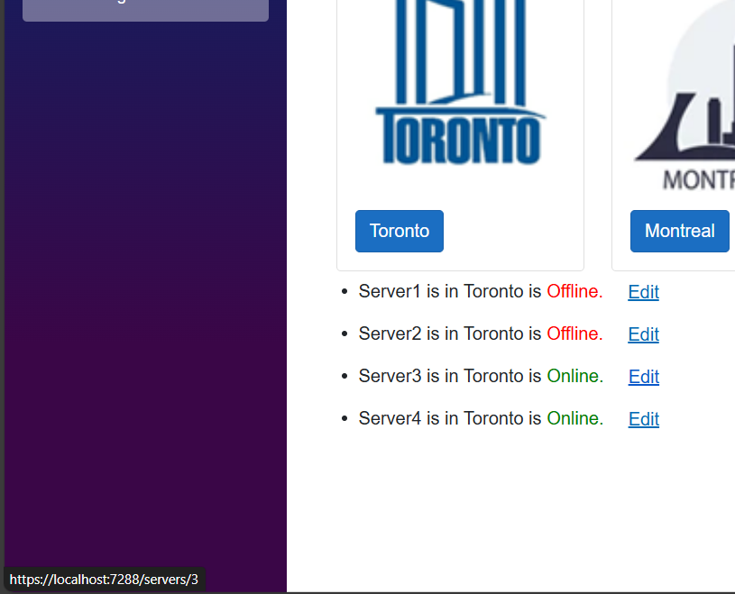
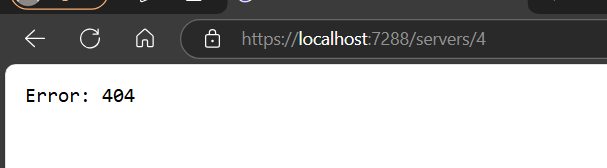
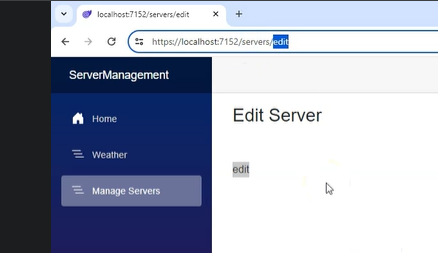
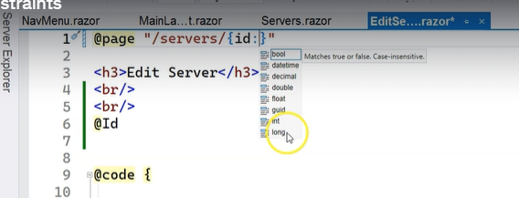
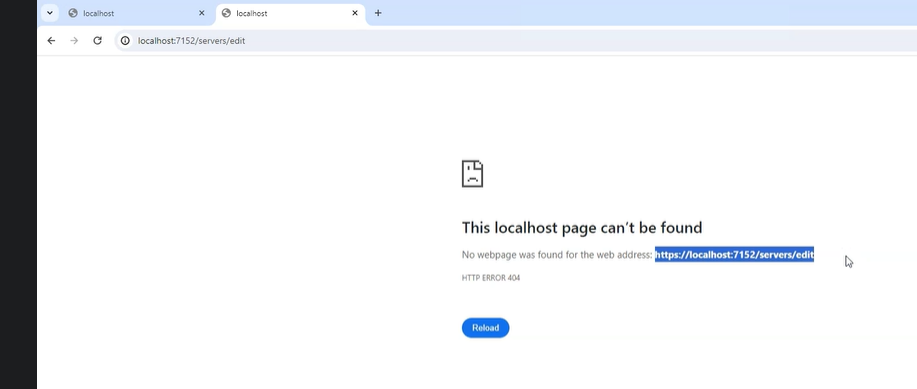
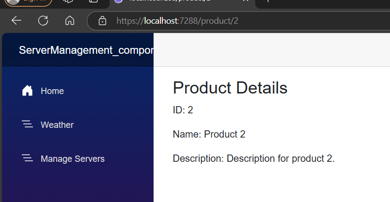

 # Route Parameters & Route Constraints
 Route parameter is a way to capture values from the URL 
 and use them within your Blazor components. 
 Route parameters are defined in the Router component and 
 can be accessed in your Blazor components using the RouteData property.

 whenever we click on Edit link > we need to pass the id to fetch or edit 
 particular details

 ## Goto servers.razor
 <a href="/servers/@server.ServerId" class="btn btn-link">Edit</a>

 Check in the browser
 
 in the botttom left you can see the id

 But while click the edit button we are getting error
 

 Next we need to change the code in `EditServer.razor` as well
 ```razor
 @page "/servers/{id}"
<h3>EditServer</h3>

<br/>
<br/>
@Id
@code {

    [Parameter]
    public string? Id { get; set; }
}
 ```

 

 here we should not accept the id as string .for that we use RouteContraint

 # RouteContraint
 

 `EditServer.razor` 

@page "/servers/{id:int}"

 

 # Use OnParametersSet to receive parameter value
 ## what is OnParametersSet in blazor ?

 OnParametersSet is a lifecycle method in Blazor that gets called 
 when the component's parameters have been set or updated.
  This method allows you to perform any initialization or 
  re-initialization based on the updated parameters.

  ### When Is It Called?
  OnParametersSet is invoked after the component has received its initial parameters from its parent component.

It's also called every time the parameters are updated (e.g., when the parent component re-renders and passes new values to the child component).


### Use Cases
**Initialization:** Perform initial setup or state updates based on the parameters received.

**Parameter Changes:** Handle logic that needs to run whenever the parameters change.

**Data Fetching:** Fetch data based on parameter values when they are set or updated.

# Example Scenario

Let's consider a scenario where you have a ProductDetails component that displays details of a product based on a productId parameter.

##  ProductDetails.razor
```razor
@page "/product/{productId}"
@using System.Threading.Tasks

<h3>Product Details</h3>
<div>
    <p>ID: @product.Id</p>
    <p>Name: @product.Name</p>
    <p>Description: @product.Description</p>
</div>

@code {
    [Parameter]
    public string ProductId { get; set; }

    private Product product = new Product();

    protected override async Task OnParametersSetAsync()
    {
        // Fetch the product details based on the ProductId parameter
        product = await FetchProductAsync(ProductId);
    }

    private async Task<Product> FetchProductAsync(string productId)
    {
        // Simulate an asynchronous data fetch operation
        await Task.Delay(1000);
        return new Product
        {
            Id = productId,
            Name = $"Product {productId}",
            Description = $"Description for product {productId}."
        };
    }

    public class Product
    {
        public string Id { get; set; }
        public string Name { get; set; }
        public string Description { get; set; }
    }
}

```


## Let us Gowith `EditServer.razor` 
and load the data based parameterset or update in EditServer
```razor

@page "/servers/{id:int}"
<h3>EditServer</h3>

<br/>
<br/>
@if (server != null)
            {
                <p>@server.ServerId</p>
                <p>@server.Name</p>
                <p>@server.City</p>
                <p>@server.IsOnline</p>
            }

<a href="/servers" class="btn btn-primary">Close</a>

@code {

    [Parameter]
    public int Id { get; set; }

    private Server? server;
    protected override void OnParametersSet()
    {
        server = ServersRepository.GetServerById(this.Id);

    }
}
```