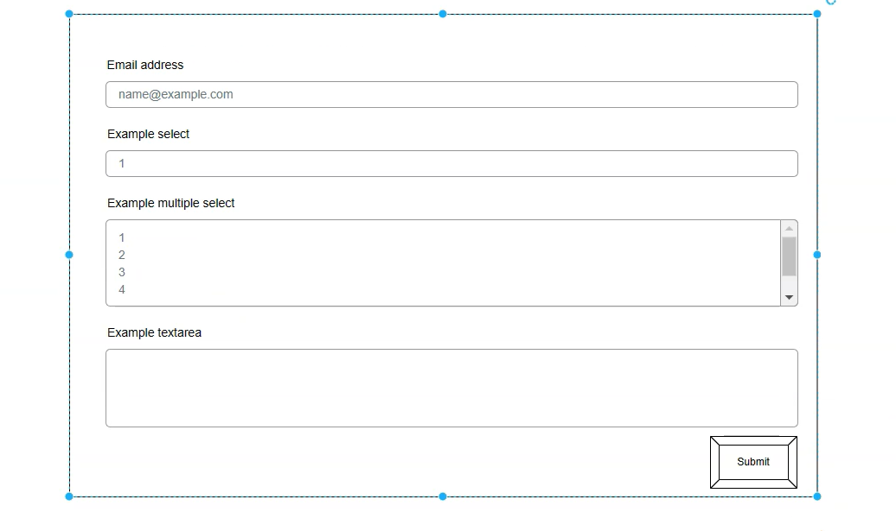
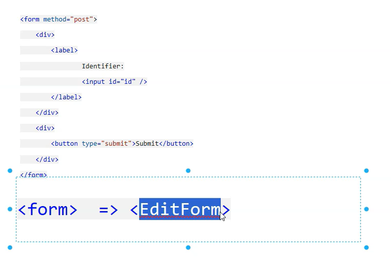
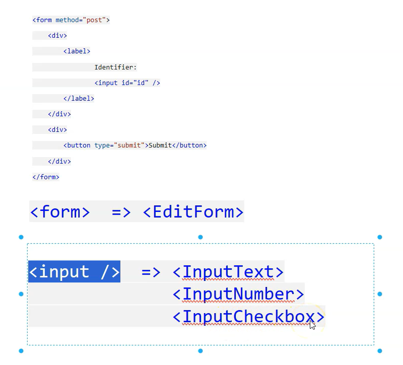
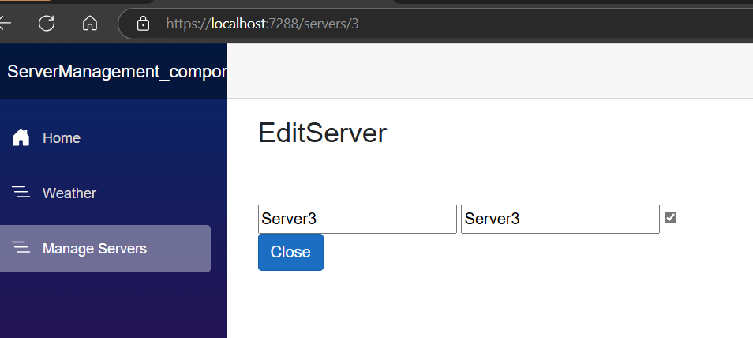
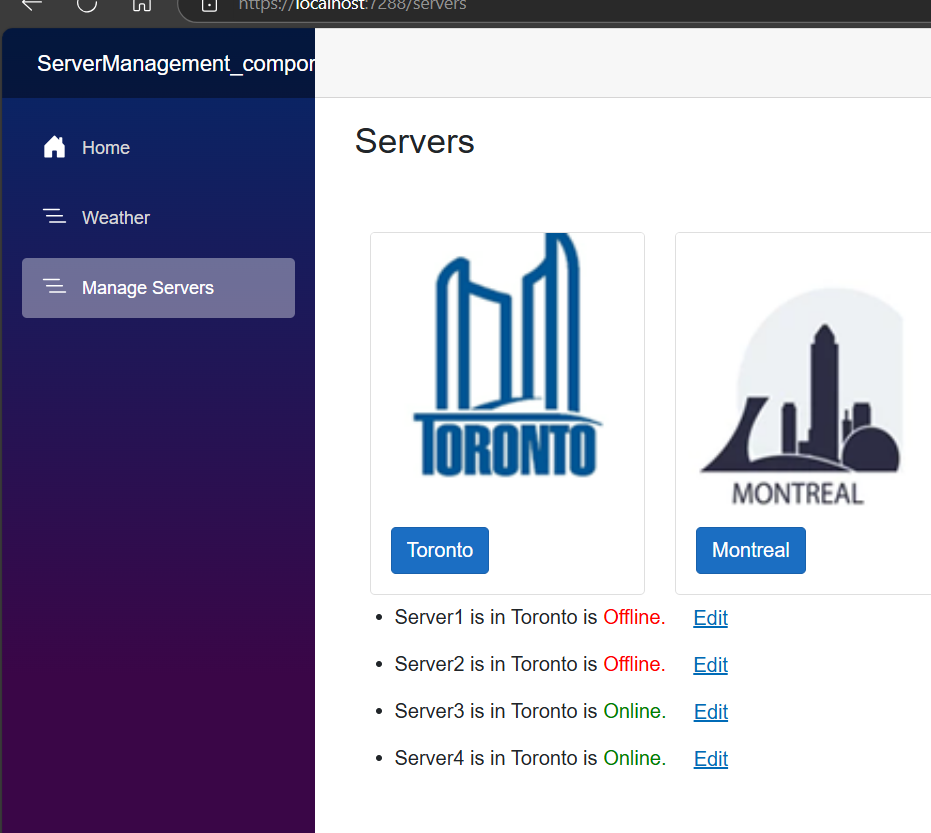

# Use Form and Input components to display and collect data




Instead of using html form microsoft provides builtin form



## How Blazor form differ from html Form

### Blazor Forms
**Component-Based:** Blazor forms are built using Blazor components, which are reusable UI elements.

**Data Binding:** Blazor provides two-way data binding, making it easier to manage form state and update the UI automatically when the data changes.

**Event Handling:** Blazor uses event handlers that are defined in C# code, which can be more intuitive for developers familiar with C#.

**Validation:** Blazor has built-in support for validation using data annotations and custom validation logic.

**Interactivity:** Blazor forms can be more interactive and dynamic, allowing for complex UI behaviors and state management.
instead of displaying the data lets display in Form

## HTML Forms

**Markup-Based:** HTML forms are defined using HTML markup, which can be simpler for basic form structures.

**Client-Side Validation:** HTML forms typically rely on client-side validation using JavaScript or frameworks like jQuery.

**Server-Side Processing:** Data from HTML forms is usually processed on the server-side using ASP.NET Core controllers or Razor Pages.

**Less Interactive:** HTML forms are generally less interactive compared to Blazor forms, especially for complex UI behaviors.

# Example: Blazor Form
```razor
@page "/register"
@using System.ComponentModel.DataAnnotations
@using Microsoft.AspNetCore.Components.Forms
@using Microsoft.AspNetCore.Components.Web

<h3>Register</h3>

<EditForm Model="@user" OnValidSubmit="HandleValidSubmit">
    <DataAnnotationsValidator />
    <ValidationMessage For="@(() => user.Name)" />

    <div class="form-group">
        <label for="name">Name:</label>
        <InputText id="name" @bind-Value="user.Name" />
    </div>

    <div class="form-group">
        <label for="email">Email:</label>
        <InputText id="email" @bind-Value="user.Email" />
    </div>

    <button type="submit" class="btn btn-primary">Register</button>
</EditForm>

@code {
    private User user = new User();

    private void HandleValidSubmit()
    {
        // Handle form submission
        Console.WriteLine("Form submitted successfully.");
    }
}

public class User
{
    [Required]
    public string Name { get; set; }

    [Required]
    [EmailAddress]
    public string Email { get; set; }
}

```
# Example: HTML Form

```html
<!DOCTYPE html>
<html lang="en">
<head>
    <meta charset="UTF-8">
    <meta name="viewport" content="width=device-width, initial-scale=1.0">
    <title>Register</title>
</head>
<body>
    <h3>Register</h3>

    <form action="/register" method="post">
        <div class="form-group">
            <label for="name">Name:</label>
            <input type="text" id="name" name="name" required>
        </div>

        <div class="form-group">
            <label for="email">Email:</label>
            <input type="email" id="email" name="email" required>
        </div>

        <button type="submit" class="btn btn-primary">Register</button>
    </form>
</body>
</html>

```

## Summary
Blazor forms are more integrated with the .NET ecosystem, offering better data binding, validation, and interactivity.

HTML forms are simpler and more straightforward, but may require additional JavaScript for advanced features.

## EditServer.Razor
```razor
@if (server != null)
            {
                <EditForm Model="server">
                    <InputText @bind-Value="@server.Name"></InputText>
                    <InputText @bind-Value="@server.Name"></InputText>
                    <InputCheckbox @bind-Value="@server.IsOnline"></InputCheckbox>
                </EditForm>
            }
```




<mark>For Offline checkbox unchecked</mark>

Let us add some style for the form
```razor
@page "/servers/{id:int}"
<h3>EditServer</h3>

<br/>
<br/>
@if (server != null)
            {
                <EditForm Model="server">
                    <div class="mb-3">
                        <div class="col-2">
                            <label class="col-form-label">Name</label>
                        </div>
                        <div class="col-6">
                            <InputText @bind-Value="@server.Name" class="form-control"></InputText>
                        </div>
                    </div>
                    <div class="mb-3">
                        <div class="col-2">
                            <label class="col-form-label">City</label>
                        </div>
                        <div class="col-6">
                            <InputText @bind-Value="@server.City" class="form-control"></InputText>
                        </div>
                    </div>
                    <div class="mb-3">
                        <div class="col-2">
                            <label class="col-form-label">Online</label>
                        </div>
                        <div class="col-6">
                            <InputCheckbox @bind-Value="server.IsOnline" class="form-check-input"></InputCheckbox>
                        </div>
                    </div>
                </EditForm>
            }

<a href="/servers" class="btn btn-primary">Close</a>

@code {

    [Parameter]
    public int Id { get; set; }

    private Server? server;
    protected override void OnParametersSet()
    {
        server = ServersRepository.GetServerById(this.Id);

    }
}


```