# Blazor 8.0 New Features

Static server side rendering        

Streaming Rendering


.NET 7 How it was works

Static server rendering


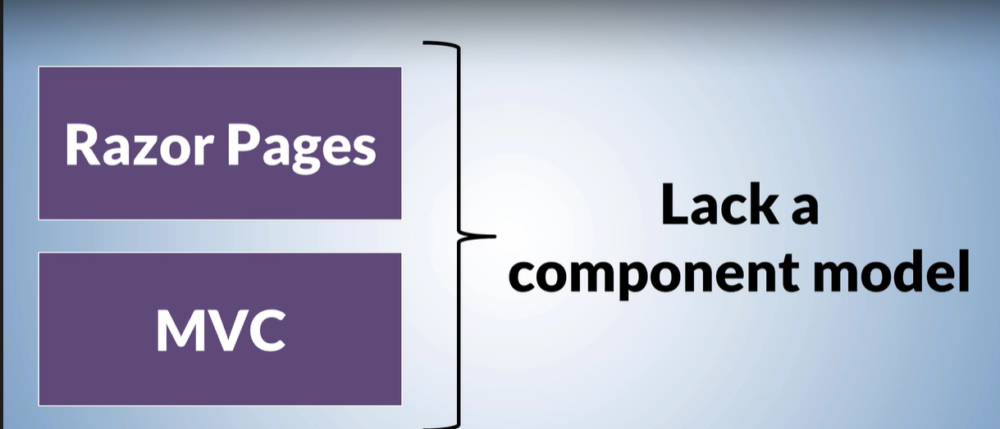


Blazor server has following Benefits


first app loads faster because the download size is small


It is not possible to deliver the app through content delivery network

Blazor web assembly hosting Model


upfront decision


Blazor web app in .Net 8.0


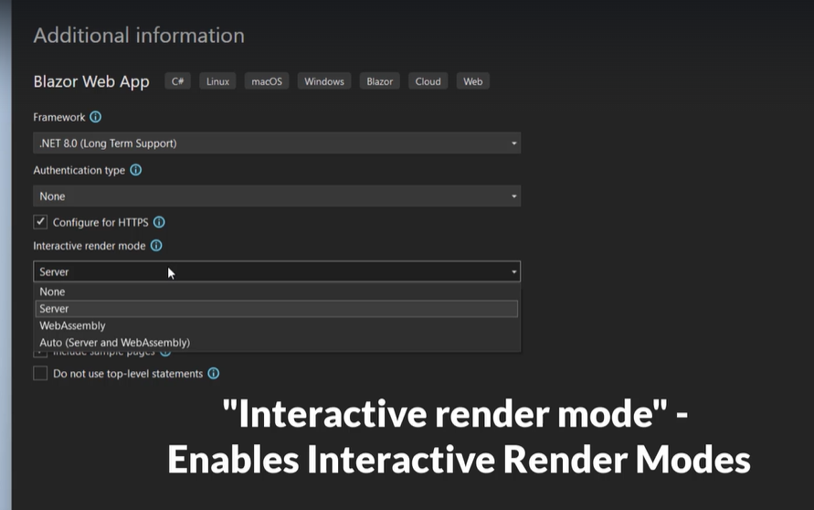


imports.razor contains common using directives

 

appsetting.json

wwwroot folder


server app


client project (webassembly)
Create a new project with Blazro web app  (BlazorAppNewFeaturesDotnet8)
interactive render mode Auto
interactive location ==>Global
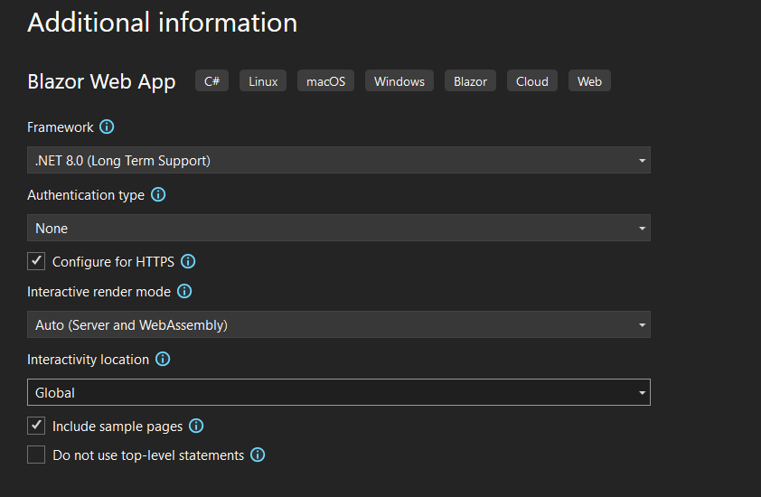

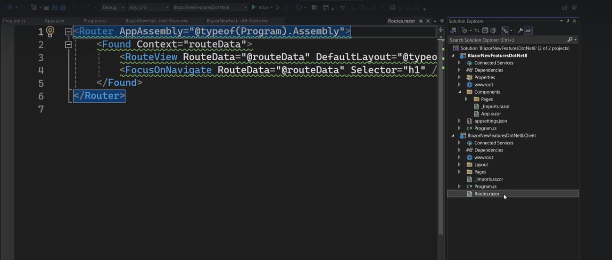


Server program.cs


open the project we created already(BlazorAppNewFeatures)

Balzor 8.0 Static Server Rendering

steps


imports page has common razor directives such as using direcrives

app settings.json file will have all configuration settings.

Launchsettings.json
Mainlayout page is rendering navmenu component and it contains error ui as well


Stylesheet for the mainLyout namvmenu


Program.cs 


commecnt line 7 and 25 to make static server rendering

Goto App.razor
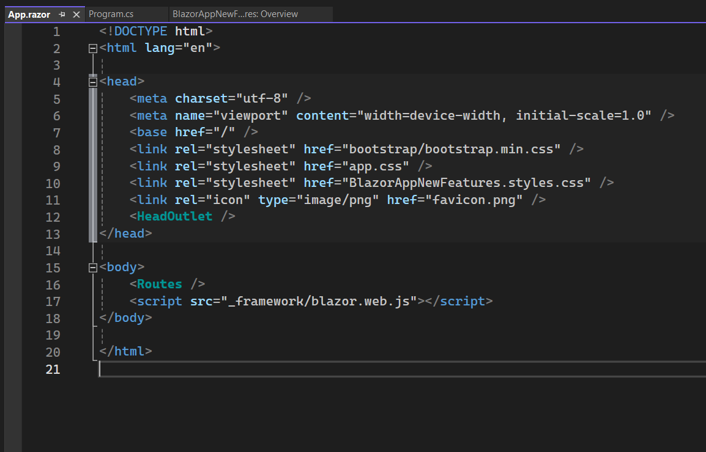

app.razor is the page act as root component

comment line no 17 

route component sets the routing

expand Pages folder ==> goto Counter.razor
 the below image shows that interactive server mode enables.


 => lets turn off interactivity component by removing the
 **  @rendermode InteractiveServer**
Goto weather.razor
StreamRendering enabled in weather page

let us turn off streamrendering as well by removing the
  **@attribute [StreamRendering]**

  Now lets run the app


click the counter button .There is no action happened which means


#  Enhanced Navigation and Form Handling


blazor.web.js calaculates the changes and it updates the changes .It do not change the total DOM


Now go back to the project 
aap.razor  
as we commented  <script src="_framework/blazor.web.js"></script>

run the application
inspect element 
navigate from home to counter  focus the refresh button of the page while navigation (small flip happens)

go back to the application ==> uncomment the below code in app.razor
<script src="_framework/blazor.web.js"></script>

this turns on enhanced navigation by default.


it means it is using balzor.web.js
goto home.razor
by default enhanced naviagation enabled by default.


What if we need to disable enhanced navigation on per link basis


```razor
@page "/"

<PageTitle>Home</PageTitle>

<h1>Hello, world!</h1>

Welcome to your new app.

<div data-enhance-nav="false">
    <a href="counter">Counter</a>
</div>
```


Scenario to disable the enhanced navigation
such as navigating from Razor component to Non-razor component like razor pages


First we need register the services in **program.cs**
```cs
builder.Services.AddRazorPages();
app.MapRazorPages();
```
# Program.cs
```cs
using BlazorAppNewFeatures.Components;

var builder = WebApplication.CreateBuilder(args);

// Add services to the container.
builder.Services.AddRazorComponents()
    .AddInteractiveServerComponents();
builder.Services.AddRazorPages();
var app = builder.Build();

// Configure the HTTP request pipeline.
if (!app.Environment.IsDevelopment())
{
    app.UseExceptionHandler("/Error", createScopeForErrors: true);
    // The default HSTS value is 30 days. You may want to change this for production scenarios, see https://aka.ms/aspnetcore-hsts.
    app.UseHsts();
}

app.UseHttpsRedirection();

app.UseStaticFiles();
app.UseAntiforgery();

app.MapRazorComponents<App>()
    .AddInteractiveServerRenderMode();
app.MapRazorPages();
app.Run();

```

Right click the Project ==> Add New folder==> Name it as Pages==>Righ click the Pages Folder ==> add Razor Page ==> Razor Page empty template ==> name it as Test (Test.cshtml)
# test.cshtml
```cshtml
@page
@model BlazorAppNewFeatures.Pages.TestsModel
@{
}

<h1> This is a Test Page</h1>
```

Goto Home.razor
change the code as below

```razor
@page "/"

<PageTitle>Home</PageTitle>

<h1>Hello, world!</h1>

Welcome to your new app.

<div>
    <a href="test">Test</a>
</div>
```

Run the application
inspect ==> network ==> check the preserve log 


now first test requst made for the page .then fullpage request made for the  test page and we got the response here .This  is  because


# home.razor 
```razor
@page "/"

<PageTitle>Home</PageTitle>

<h1>Hello, world!</h1>

Welcome to your new app.

<div data-enhance-nav="false">
    <a href="test">Test</a>
</div>
```

build you solution and  run ==> inspect ==> network ==> check the preserve log 


# Data permanent Attribute
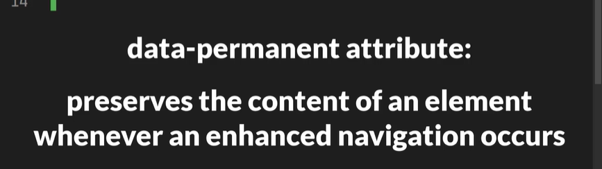

goto MainLayout.razor
 <div id="myDiv">
     </div>

     <script>
    var element=document.querySelector("#myDiv");
    element.innerHTML="<h1> Div content</h1>";
    </script>
# MainLayout.razor

```razor
@inherits LayoutComponentBase

<div class="page">
    <div class="sidebar">
        <NavMenu />
    </div>

    <main>
        <div class="top-row px-4">
            <div id="myDiv">
                </div>

            <a href="https://learn.microsoft.com/aspnet/core/" target="_blank">About</a>
        </div>

        <article class="content px-4">
            @Body
        </article>
    </main>
</div>

<div id="blazor-error-ui">
    An unhandled error has occurred.
    <a href="" class="reload">Reload</a>
    <a class="dismiss">🗙</a>
</div>
<script>
    var element=document.querySelector("#myDiv");
    element.innerHTML="<h1> Div content</h1>";
    </script>
```

Run the Application 


navigate to counter 


navigate to Home


Now Div content is not there in bith component header

low lets understand why this happens


when we navigate to any component usong enhanced navigation the components executes on server to produce the response html and that html is added to the response and send back to the  browser

now blazor web js 


to make this permanent we need to use data-permanent attribute
# MainLayout.razor
    <div id="myDiv" data-permanent>

    Re Run the app.

    

    

# Enhanced page load event for listen the enhanced page updates and streaming updates
    

  # app.razor

   <script>
     Blazor.addEventListener("enhancedload",
     () => console.log("there was an enhanced update!.."));
     </script>
# app.razor
```razor
<!DOCTYPE html>
<html lang="en">

<head>
    <meta charset="utf-8" />
    <meta name="viewport" content="width=device-width, initial-scale=1.0" />
    <base href="/" />
    <link rel="stylesheet" href="bootstrap/bootstrap.min.css" />
    <link rel="stylesheet" href="app.css" />
    <link rel="stylesheet" href="BlazorAppNewFeatures.styles.css" />
    <link rel="icon" type="image/png" href="favicon.png" />
    <HeadOutlet />
</head>

<body>
    <Routes />
    <script src="_framework/blazor.web.js"></script>
    <script>
        Blazor.addEventListener("enhancedload",
        () => console.log("there was an enhanced update!.."));
        </script>
</body>

</html>
```
run the application
inspect ==> navigate to any component

whenever we move the count gets incremented


when we want to navigate programatically 
we should use 


forceload false by default. when forceload is false


# Form handling

## Home.razor
```razor
@using System.ComponentModel.DataAnnotations;
@page "/"

<PageTitle>Home</PageTitle>

<h1>Hello, world!</h1>

Welcome to your new app.
<div style="height:100vh"></div>

<EditForm  FormName="CreateForm" method="post" Model="@Item" @onValidSubmit ="AddEmployee()">
   <DataAnnotationsValidator/>
    <ValidationSummary/>
    <div>
    <label>Name:</label>
    <InputText @bind-Value="@Item.Name" />
    </div>
    <button>Submit </button>
    </EditForm>

@code{
    [SupplyParameterFromForm]
    public Employee Item {get;set;}=new ();
    private void AddEmployee(){
        //write the logic
    }
    public class Employee{
        [Required]
        public string? Name {get;set;}
    }
}
```
Run the app  .Bydefault  enhance scroll is disabled.

user scroll position is  lost
enter the Name and submit ==> again user scroll position is  lost (goes to the top of the page)


then we need to scroll down 

to avoid the lose of scrol position we use enhance attribute
Now add 
<EditForm Enhance
  FormName="CreateForm" method="post" Model="@Item" @onValidSubmit ="AddEmployee()">


and rerun the app


This is how user scroll position is not lost anymore

# Stream Rendering


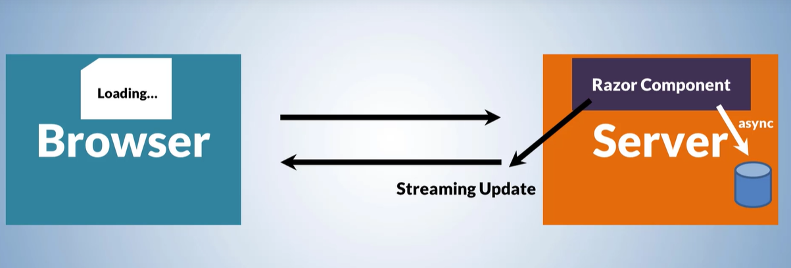


Goto BlazorAppNewFeatures

app.razor
comment velow line of code 
    @*<script src="_framework/blazor.web.js"></script>*@

weather.razor

comment
@* @attribute [StreamRendering] *@
   await Task.Delay(1000);

   and run the app ==> Navigate to weather ==> which is not showing loading..
    instead it is loading the content after 1s. 


    Now enable app.razor uncomment the below line
    <script src="_framework/blazor.web.js"></script>
    weather.razor 
    add the below line
     @attribute [StreamRendering]

     And run the App
     
     then it wilrender the data after 1s


     # Render Modes
     

     
     
     
     
     
     


     goto BlazorAppNewFeaturesDotnet8 project


**`.AddInteractiveServerComponents() `**
adds the necessary services to supprots rendering interacrive server components

**`.AddInteractiveWebAssemblyComponents()`** in Blazor WebAssembly 8.0 is used to add services that support rendering interactive WebAssembly components. This is particularly useful when you want to create interactive components that can run in the browser using WebAssembly, even if the rest of your application is using server-side rendering.

By calling this method, you're essentially configuring your Blazor WebAssembly app to handle interactive components, which can improve the user experience by making parts of your app more dynamic and responsive


**`.AddInteractiveServerRenderMode() `**in Blazor WebAssembly 8.0 is used to enable interactive server-side rendering (SSR) for your Blazor Web App. This means that your components can be rendered on the server initially, and then become interactive on the client side once the Blazor WebAssembly bundle is downloaded.

Here's a brief overview of how it works:

**Initial Server Rendering:** When a user first visits your Blazor Web App, the components are rendered on the server.

**Client Interactivity:** After the initial render, the Blazor WebAssembly bundle is downloaded to the client's browser, and the components become interactive.

**Improved Performance**: This approach can improve the initial load time and user experience, as the user sees content faster while still benefiting from the interactivity of Blazor WebAssembly.

`**.AddInteractiveWebAssemblyRenderMode()**` in Blazor 8.0 is used to enable interactive client-side rendering using Blazor WebAssembly. This means that your components will be rendered on the client side using WebAssembly, allowing for a more interactive and responsive user experience1.

Here's a brief overview of how it works:

**Client-Side Rendering:** The components are rendered on the client's browser using Blazor WebAssembly.

**Interactivity:** The components are fully interactive, meaning they can handle user input and update the UI dynamically without needing to reload the page.

**Improved Performance:** This approach can improve the user experience by reducing the initial load time and making the app more responsive.

`**.AddAdditionalAssemblies(typeof(Counter).Assembly)**` in Blazor 8.0 is used to include additional assemblies in your Blazor Web App. This is particularly useful when you have components or dependencies in separate projects that you want to use in your main Blazor project.

By specifying typeof(Counter).Assembly, you're telling Blazor to include the assembly that contains the Counter component. This ensures that Blazor can find and use the components and dependencies within that assembly.

lets demo it

in server project ==> expand the component folder ==> right click the Pages folder ==>Add Razor component 


Name it as RenderModes

nagivate to navmenu component in client project
add the below link at last 
<div class="nav-item px-3">
    <NavLink class="nav-link" href="render-modes">
        <span  aria-hidden="true"></span> Blazor Render Modes
    </NavLink>
</div>

i have removed the class for span tag


goto server project ==> Pages ==> Add new Razorcomponent==>
Name it as ShowMessage.razor
```cs
<h3>@message</h3>

<button @onclick="HandleShowMessageClick" class="btn btn-primary">ShowMessage</button>

@code {

    private string? message;
    private void HandleShowMessageClick()
    {
        message = "Message 1";
    }
}
```

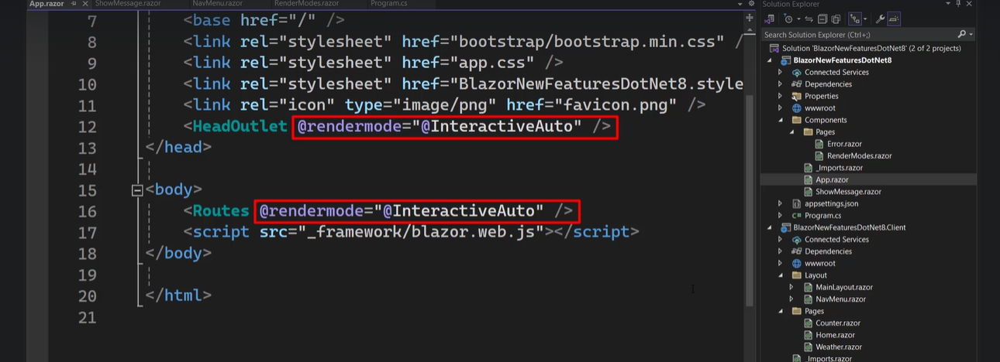

routes.razor


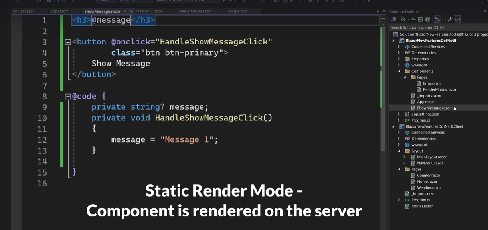

Run the app


click button 
there is no interaction as it is rendering static server rendering


RenderModes.razor

@page "/render-modes"

<h3>RenderModes</h3>
<ShowMessage @rendermode="InteractiveServer"/>
@code {

}


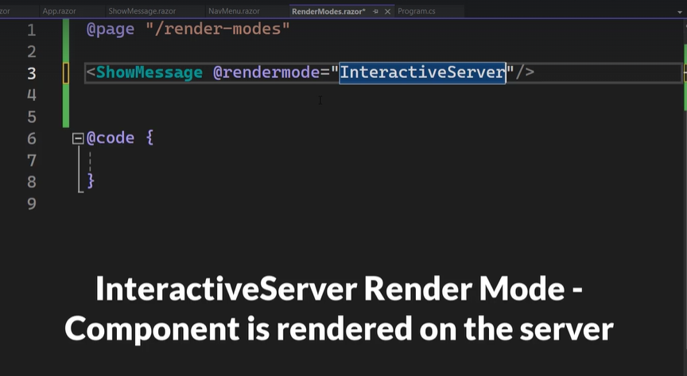
the component is using InteractingServer rendering hosting model

in wasm tab there is no assemblies download it means interactive 
client rendering using webassembly is not used.

Click the button . It is showing the message (interactive)


# Iteractivewebassembly

rightclick on showMessage.razor ==> cut and paste in client project


Goto RenderModes.razor component
change the render mode to interactivewebassembly


Run the app


It download all necessary things and render the component

in ws tab there is no web socket connection made.This is because interactiveserver not using for rendering


# InteractiveAuto


Run the app

inspect ==> stores ==>clear the site data

then move to network in inspect ==> ws ==> click on Blazor render modes

and look into wasm as well


click the button  button also interactive


goto client project => showMessage.razor

```cs
<h3>@message</h3>
<h4>@Message</h4>

<button @onclick="HandleShowMessageClick" class="btn btn-primary">ShowMessage</button>

@code {

    private string? message;

    [Parameter]
    public string? Message { get; set; }
    private void HandleShowMessageClick()
    {
        message = "Message 1";
    }
}

```
goto Rendermodes.razor component in server

```cs

@page "/render-modes"

<h3>RenderModes</h3>
<ShowMessage @rendermode="InteractiveAuto" Message="Message from Parent"/>
@code {

}

```

# goto showmessage add one more property

   @ChildContent 
[Parameter]
    public RenderFragment? ChildContent { get; set; }


```cs
<h3>@message</h3>
<h4>@Message</h4>

@ChildContent
<button @onclick="HandleShowMessageClick" class="btn btn-primary">ShowMessage</button>

@code {

    private string? message;

    [Parameter]
    public string? Message { get; set; }
    [Parameter]
    public RenderFragment? ChildContent { get; set; }
    private void HandleShowMessageClick()
    {
        message = "Message 1";
    }
}
```


# goto RenderModes.razor

@page "/render-modes"

<h3>RenderModes</h3>
<ShowMessage @rendermode="InteractiveAuto" Message="Message from Parent">
    Child Content
    </ShowMessage>
@code {

}


run the app
will get an below error

undo the changes we made

ShowMessage.razor
<h3>@message</h3>


<button @onclick="HandleShowMessageClick" class="btn btn-primary">ShowMessage</button>

@code {

    private string? message;

    [Parameter]
    public string? Message { get; set; }
   
    private void HandleShowMessageClick()
    {
        message = "Message 1";
    }
}


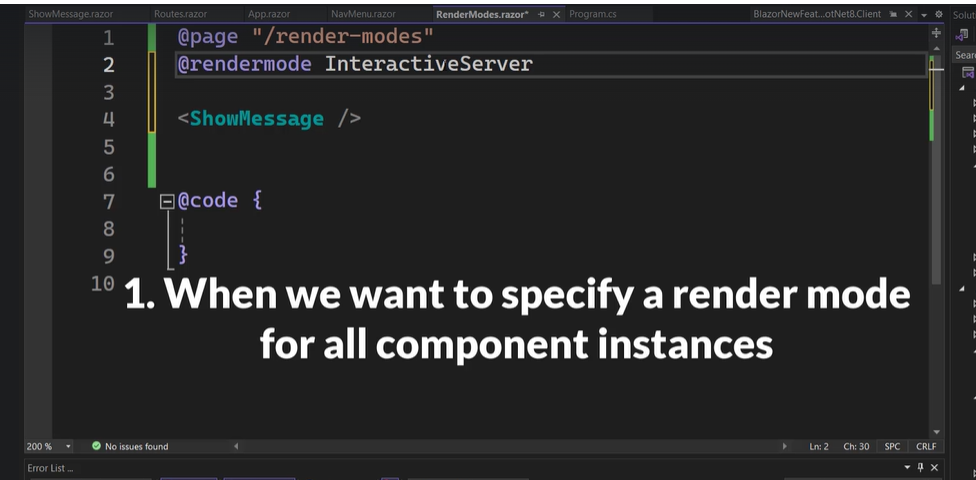
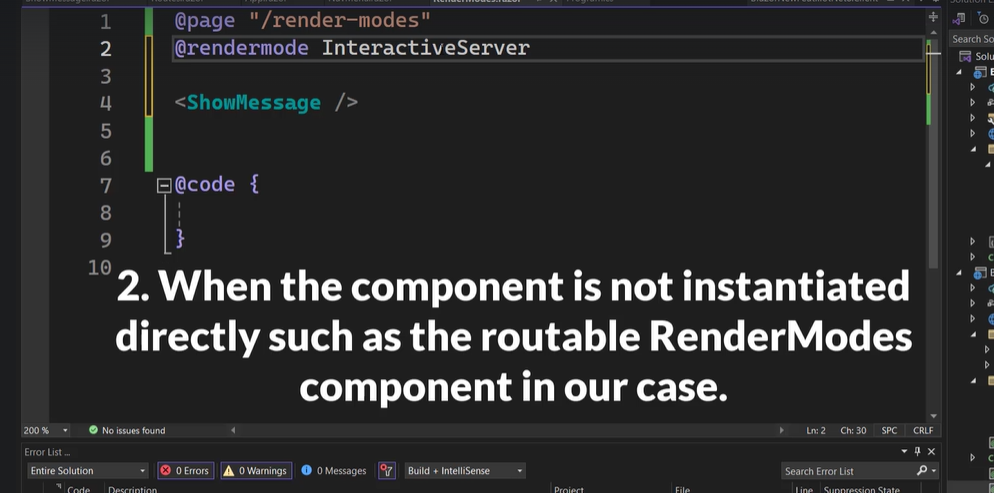

in the pagelevel we have Interativeserver. but in c
hild component we cannot have Interactivewebassembly


Let set the Global interactive in app.razor


How to disable prerendering globally


# Blazor Sections


