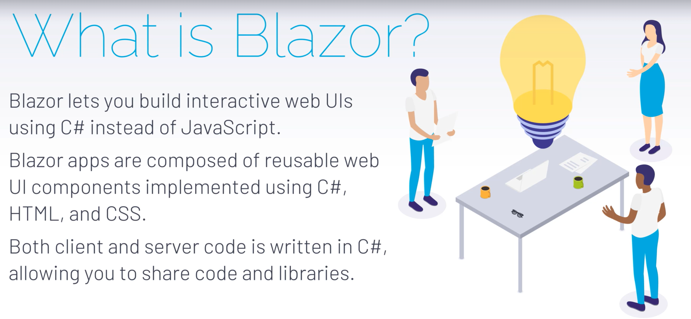
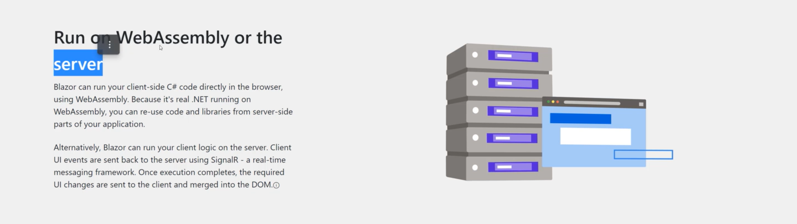
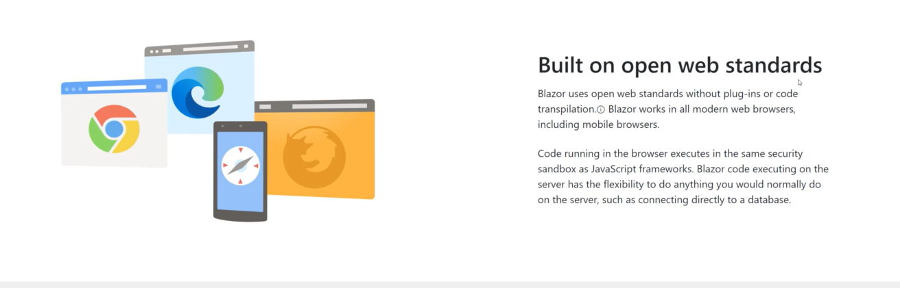

Blazor Web Assembly

 Create and Understand Blazor Project Structure

create new project 
 Blazor server app => it sit on server 
BookstoreApp.blazor.server.UI

Authentication ==> none as we use api for authentication

_host.cshtml ==>

render_mode =5 modes

_Layout.cshtml

@page "/ ==> index.cshtml  path

imports.razor ==> it is registering all of the libraries
if we need add our own namespace in all components we can register here

