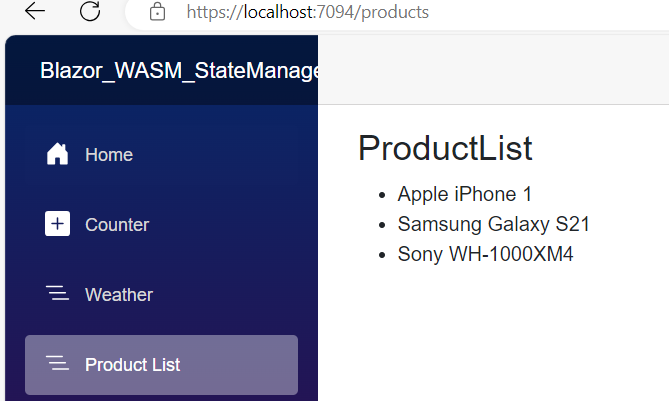
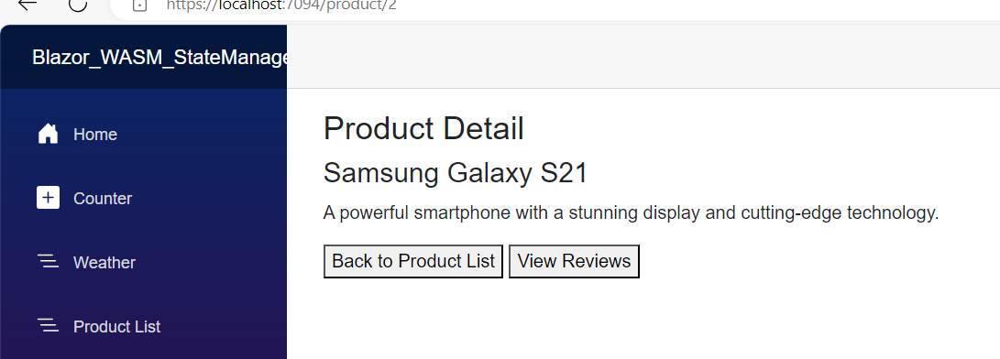
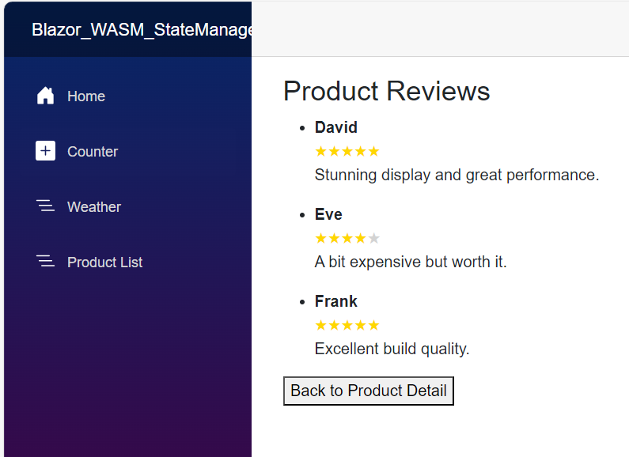
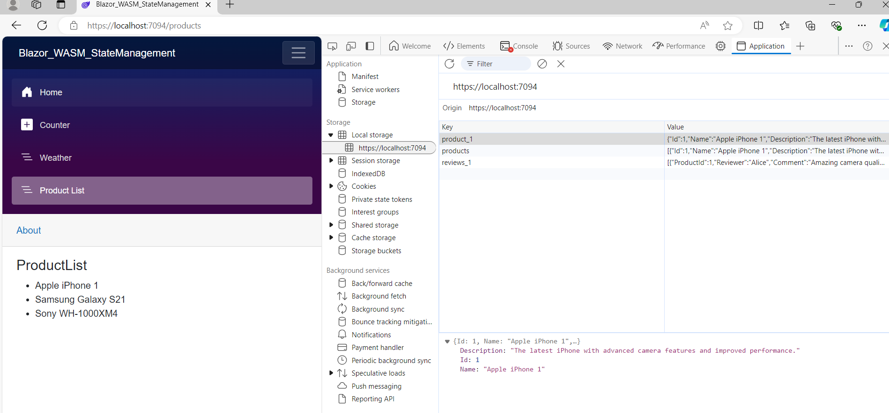

# State Management
State management in Blazor WebAssembly is crucial for maintaining the state of your application across different components and user interactions. Here are some common approaches:

**Local Storage:** You can use the browser's local storage to persist state across sessions. This is useful for storing user preferences or other data that needs to persist even when the browser is closed and reopened2.

**Session Storage:** Similar to local storage, but with a shorter lifespan, session storage is cleared when the browser session ends.

**JavaScript Interop:** Blazor allows you to interact with JavaScript, which can be useful for more complex state management scenarios.

**Dependency Injection:** You can use dependency injection to manage state across components. This involves creating a service that holds the state and injecting it into the components that need it2.

**Fluxor:** This is a popular library for implementing the Flux pattern in Blazor. It helps manage state changes in a predictable way, making it easier to debug and test your application3.

 # Use URL to pass info across routable components

 Add Models folder 
 ## 1.Add Product class

 ```cs
   public class Product
  {
          public int Id { get; set; }
          public string Name { get; set; }
          public string Description { get; set; }
  }
  ```
## Add Review Class
```cs
 public class Review
 {
     public int ProductId { get; set; }
     public string Reviewer { get; set; }
     public string Comment { get; set; }
     public int Rating { get; set; }
 }
```
  Add Repository Folder
  Add ProductRepository class
  ```cs
public class ProductRepository
{
       private List<Product> products = new List<Product>
    {
        new Product { Id = 1, Name = "Apple iPhone 1", Description = "The latest iPhone with advanced camera features and improved performance." },
        new Product { Id = 2, Name = "Samsung Galaxy S21", Description = "A powerful smartphone with a stunning display and cutting-edge technology." },
        new Product { Id = 3, Name = "Sony WH-1000XM4", Description = "High-quality noise-canceling headphones with exceptional sound clarity." }
    };
    private List<Review> reviews = new List<Review> {
        new Review { ProductId = 1, Reviewer = "Alice", Comment = "Amazing camera quality!", Rating = 5 },
        new Review { ProductId = 1, Reviewer = "Bob", Comment = "Battery life could be better.", Rating = 4 },
        new Review { ProductId = 1, Reviewer = "Charlie", Comment = "Very smooth performance.", Rating = 5 },
        new Review { ProductId = 2, Reviewer = "David", Comment = "Stunning display and great performance.", Rating = 5 },
        new Review { ProductId = 2, Reviewer = "Eve", Comment = "A bit expensive but worth it.", Rating = 4 },
        new Review { ProductId = 2, Reviewer = "Frank", Comment = "Excellent build quality.", Rating = 5 },
        new Review { ProductId = 3, Reviewer = "Grace", Comment = "Best noise-canceling headphones.", Rating = 5 },
        new Review { ProductId = 3, Reviewer = "Heidi", Comment = "Very comfortable to wear.", Rating = 4 },
        new Review { ProductId = 3, Reviewer = "Ivan", Comment = "Sound quality is top-notch.", Rating = 5 }
};
    public List<Product> GetProducts()
    {
        return products;
    }

    public Product GetProductById(int productId)
    {
        return products.FirstOrDefault(p => p.Id == productId);
    }
    public List<Review> GetReviewsByProductId(int productId)
    { 
        return reviews.Where(r => r.ProductId == productId).ToList(); 
    }
}
  ```
# Register the ProductRepository Service

Register the ProductRepository service in your Program.cs:
`builder.Services.AddSingleton<ProductRepository>();`

  In Pages folder ==> Add 3 Component
  1.ProductList.razor
  2.ProductDetail.razor
  3.ProductReview.razor

  # ProductList.razor
  ```razor
@page "/products"
@using Blazor_WASM_StateManagement.Models
@inject ProductRepository productRepository
@inject NavigationManager Navigation
<h3>ProductList</h3>
<ul>
    @foreach(var product in products)
    {
        <li>
            <a @onclick="() =>NavigateToProduct(product.Id)">@product.Name</a>
        </li>
    }
</ul>

@code {
    private List<Product> products;
    protected override void OnInitialized()
    {
        products = productRepository.GetProducts();
    }
    public void NavigateToProduct(int productId)
    {
        Navigation.NavigateTo($"/product/{productId}");
    }
}

```

# ProductDetail.razor
```razor
@page "/product/{productid:int}"
@inject NavigationManager Navigation
@inject ProductRepository productRepository
<h3>Product Detail</h3> @if (product != null)
{
     <div> <h4>@product.Name</h4>
         <p>@product.Description</p>
         <button @onclick="NavigateBack">Back to Product List</button> 
         <button @onclick="NavigateToReviews">View Reviews</button>
     </div>
}
else
{
     <p>Loading...</p>
}

@code {
    [Parameter]
    public int productId { get; set; }
    private Product product;

    protected override void OnInitialized()
    {
         product= productRepository.GetProductById(productId);        
    }
    private void NavigateBack()
    { 
        Navigation.NavigateTo("/products");
    }
    private void NavigateToReviews() 
    { 
        Navigation.NavigateTo($"/product/{productId}/reviews");
    }
}

```

# ProductReviews.razor
```razor
@page "/product/{productId:int}/reviews"
@inject ProductRepository ProductRepository
@inject NavigationManager Navigation

<h3>Product Reviews</h3>
@if (reviews != null)
{
    <ul>
        @foreach (var review in reviews)
        {
            <li>
                <strong>@review.Reviewer</strong>
                <div>
                    @for (int i = 0; i < review.Rating; i++)
                    {
                        <span style="color: gold;">★</span>
                    }
                    @for (int i = review.Rating; i < 5; i++)
                    {
                        <span style="color: lightgray;">★</span>
                    }
                </div>
                <p>@review.Comment</p>
            </li>
        }
    </ul>
    <button @onclick="NavigateBack">Back to Product Detail</button>
}
else
{
    <p>Loading...</p>
}

@code {
    [Parameter] 
    public int productId { get; set; }
    private List<Review> reviews;

    protected override void OnInitialized()
    {
        reviews = ProductRepository.GetReviewsByProductId(productId);
    }

    private void NavigateBack()
    {
        Navigation.NavigateTo($"/product/{productId}");
    }
}


```
**Look at the below image it is maintaining the product,id,and review in url itself**

 
  

# Drawbacks of Use URL to pass data from onc component to another  
**Security Risks:** URLs can be easily manipulated, leading to potential security vulnerabilities such as cross-site scripting (XSS) attacks.

**Limited Data Size**: URLs have a length limit, which restricts the amount of data that can be passed.

**State Management:** Managing state through URLs can become cumbersome, especially for complex applications with multiple states.

**Performance:** Parsing URLs and extracting data can add overhead, impacting performance.

**URL Pollution:** Excessive use of URLs for data passing can lead to cluttered and hard-to-read URLs.

## Alternatives
Instead of using URLs to pass data, consider these alternatives:

**Component Parameters:** Pass data as parameters directly within the parent component.

**State Management Libraries:** Use libraries like **Fluxor** or Redux for state management.

**Dependency Injection:** Share services that maintain state across components using dependency injection

  # Use browser storage to maintain states

  create a new folder with the Name of stateStore
  add new Class StorageService.cs
  ```cs
  using Microsoft.JSInterop;
namespace Blazor_WASM_StateManagement.StateStore
{
    public class StorageService
    {
        private readonly IJSRuntime jsRuntime;
        public StorageService(IJSRuntime runtime)
        {
            jsRuntime = runtime;
        }

        public async Task SetItemAsync(string key,string value)
        {
            await jsRuntime.InvokeVoidAsync("localStorage.setItem",key,value);
        }
        public async Task<string> GetItemAsync(string key)
        { 
            return await jsRuntime.InvokeAsync<string>("localStorage.getItem", key);
        }
        public async Task RemoveItemAsync(string key)
        { 
            await jsRuntime.InvokeVoidAsync("localStorage.removeItem", key);
        }
    }
}

```

# ProductList.Razor
@inject StorageService StorageService
protected override async Task OnInitializedAsync()
{
    var storedProducts = await StorageService.GetItemAsync("products"); 
    if (string.IsNullOrEmpty(storedProducts))
    {
        products = ProductRepository.GetProducts(); 
        await StorageService.SetItemAsync("products",
        System.Text.Json.JsonSerializer.Serialize(products));
    } 
    else
    { 
        products = System.Text.Json.JsonSerializer.Deserialize<List<Product>>(storedProducts);
    }
}
```razor
@page "/products"
@using Blazor_WASM_StateManagement.Models
@inject StorageService StorageService
@inject ProductRepository ProductRepository
@inject NavigationManager Navigation
<h3>ProductList</h3>
<ul>
    @foreach(var product in products)
    {
        <li>
            <a @onclick="() =>NavigateToProduct(product.Id)">@product.Name</a>
        </li>
    }
</ul>

@code {
    private List<Product> products;
    protected override async Task OnInitializedAsync()
    {
        var storedProducts = await StorageService.GetItemAsync("products"); 
        if (string.IsNullOrEmpty(storedProducts))
        {
            products = ProductRepository.GetProducts(); 
            await StorageService.SetItemAsync("products",
            System.Text.Json.JsonSerializer.Serialize(products));
        } 
        else
        { 
            products = System.Text.Json.JsonSerializer.Deserialize<List<Product>>(storedProducts);
        }
    }
    public void NavigateToProduct(int productId)
    {
        Navigation.NavigateTo($"/product/{productId}");
    }
}

```
# ProductDetail.razor
@inject StorageService StorageService
 protected override async Task OnInitializedAsync() 
 { 
     var storedProduct = await StorageService.GetItemAsync($"product_{productId}"); 
     if (string.IsNullOrEmpty(storedProduct)) 
     { 
         product = productRepository.GetProductById(productId); 
         await StorageService.SetItemAsync($"product_{productId}", 
         System.Text.Json.JsonSerializer.Serialize(product));
     } 
     else
     {
        product = System.Text.Json.JsonSerializer.Deserialize<Product>(storedProduct);
     }
 }
 ```razor
@page "/product/{productid:int}"
@inject NavigationManager Navigation
@inject StorageService StorageService
@inject ProductRepository productRepository
<h3>Product Detail</h3> @if (product != null)
{
     <div> <h4>@product.Name</h4>
         <p>@product.Description</p>
         <button @onclick="NavigateBack">Back to Product List</button> 
         <button @onclick="NavigateToReviews">View Reviews</button>
     </div>
}
else
{
     <p>Loading...</p>
}

@code {
    [Parameter]
    public int productId { get; set; }

    private Product product;

    protected override async Task OnInitializedAsync() 
    { 
        var storedProduct = await StorageService.GetItemAsync($"product_{productId}"); 
        if (string.IsNullOrEmpty(storedProduct)) 
        { 
            product = productRepository.GetProductById(productId); 
            await StorageService.SetItemAsync($"product_{productId}", 
            System.Text.Json.JsonSerializer.Serialize(product));
        } 
        else
        {
           product = System.Text.Json.JsonSerializer.Deserialize<Product>(storedProduct);
        }
    }
    private void NavigateBack()
    { 
        Navigation.NavigateTo("/products");
    }
    private void NavigateToReviews() 
    { 
        Navigation.NavigateTo($"/product/{productId}/reviews");
    }
}

 ```
 # ProductReview.razor
 @inject StorageService StorageService
  protected override async Task OnInitializedAsync()
 { 
     var storedReviews = await StorageService.GetItemAsync($"reviews_{productId}"); 
     if (string.IsNullOrEmpty(storedReviews)) 
     { 
         reviews = ProductRepository.GetReviewsByProductId(productId); 
         await StorageService.SetItemAsync($"reviews_{productId}", 
         System.Text.Json.JsonSerializer.Serialize(reviews)); 
     } 
     else 
     { 
         reviews = System.Text.Json.JsonSerializer.Deserialize<List<Review>>(storedReviews); 
     }
 }

```razor
@page "/product/{productId:int}/reviews"
@inject ProductRepository ProductRepository
@inject NavigationManager Navigation
@inject StorageService StorageService
<h3>Product Reviews</h3>
@if (reviews != null)
{
    <ul>
        @foreach (var review in reviews)
        {
            <li>
                <strong>@review.Reviewer</strong>
                <div>
                    @for (int i = 0; i < review.Rating; i++)
                    {
                        <span style="color: gold;">★</span>
                    }
                    @for (int i = review.Rating; i < 5; i++)
                    {
                        <span style="color: lightgray;">★</span>
                    }
                </div>
                <p>@review.Comment</p>
            </li>
        }
    </ul>
    <button @onclick="NavigateBack">Back to Product Detail</button>
}
else
{
    <p>Loading...</p>
}

@code {
    [Parameter]
    public int productId { get; set; }
    private List<Review> reviews;

    protected override async Task OnInitializedAsync()
    { 
        var storedReviews = await StorageService.GetItemAsync($"reviews_{productId}"); 
        if (string.IsNullOrEmpty(storedReviews)) 
        { 
            reviews = ProductRepository.GetReviewsByProductId(productId); 
            await StorageService.SetItemAsync($"reviews_{productId}", 
            System.Text.Json.JsonSerializer.Serialize(reviews)); 
        } 
        else 
        { 
            reviews = System.Text.Json.JsonSerializer.Deserialize<List<Review>>(storedReviews); 
        }
    }

    private void NavigateBack()
    {
        Navigation.NavigateTo($"/product/{productId}");
    }
}

```

Run the App


# Session Storage
```cs
using Microsoft.JSInterop;

namespace Blazor_WASM_StateManagement.StateStore
{
    public class SessionStorage
    {
        private readonly IJSRuntime jsRuntime;
        // private readonly ProtectedSessionStorage protectedSessionStorage;
        public SessionStorage(IJSRuntime runtime)
        {           
            jsRuntime = runtime;
        }

        public async Task SetItemAsync(string key, string value)
        {
            await jsRuntime.InvokeVoidAsync("sessionStorage.setItem", key, value);
        }
        public async Task<string> GetItemAsync(string key)
        {
            return await jsRuntime.InvokeAsync<string>("sessionStorage.getItem", key);
        }
        public async Task RemoveItemAsync(string key)
        {
            await jsRuntime.InvokeVoidAsync("sessionStorage.removeItem", key);
        }
    }
    }
```

Then update 
Productlist.razor
ProductDetails.razor
ProductReviews.razor

and Run the App and Check Sessionstorage available perdomain and per tab. 

#  Use DI container to maintain states

Create a new class ContainerStorage class in StoreState Folder
# ContainerStorage.cs
using Blazor_WASM_StateManagement.Models;
```cs 
namespace Blazor_WASM_StateManagement.StateStore
{
    public class ContainerStorage
    {
        public List<Product> Products { get; set; }
        public Dictionary<int, List<Review>> Reviews { get; set; }
        public ContainerStorage() 
        { Products = new List<Product>(); 
            Reviews = new Dictionary<int, List<Review>>();
        }
        public void SetProducts(List<Product> products) 
        { Products = products; 
        }
        public void SetReviews(int productId, List<Review> reviews)
        { 
            Reviews[productId] = reviews;
        }
        public List<Review> GetReviews(int productId)
        { 
            return Reviews.ContainsKey(productId) ? Reviews[productId] : new List<Review>(); 
        }

    }
}
```
# program.cs
builder.Services.AddSingleton<ContainerStorage>();

# productList.razor
## change OnInitialized method logic  as below
```razor
@inject ContainerStorage ContainerStorage

protected override void OnInitialized()
{
    if (ContainerStorage.Products == null || !ContainerStorage.Products.Any()) 
    { 
        products = ProductRepository.GetProducts(); 
        ContainerStorage.SetProducts(products); } 
    else { 
        products = ContainerStorage.Products; 
    } 
}
```
# productdetail.razor
## change OnInitialized method logic  as below
```razor
    protected override void OnInitialized() { 
        product = ContainerStorage.Products.FirstOrDefault(p => p.Id == productId); if (product == null) {
            product = ProductRepository.GetProductById(productId); 
        ContainerStorage.SetProducts(ProductRepository.GetProducts());
        } 
    }
    ```

 # productreview.razor
## change OnInitialized method logic  as below   
```razor
   protected override void OnInitialized() 
   { 
       reviews = ContainerStorage.GetReviews(productId); 
       if (reviews == null || !reviews.Any()) 
       {
           reviews = ProductRepository.GetReviewsByProductId(productId); 
       ContainerStorage.SetReviews(productId, reviews);
       } 
   }
```